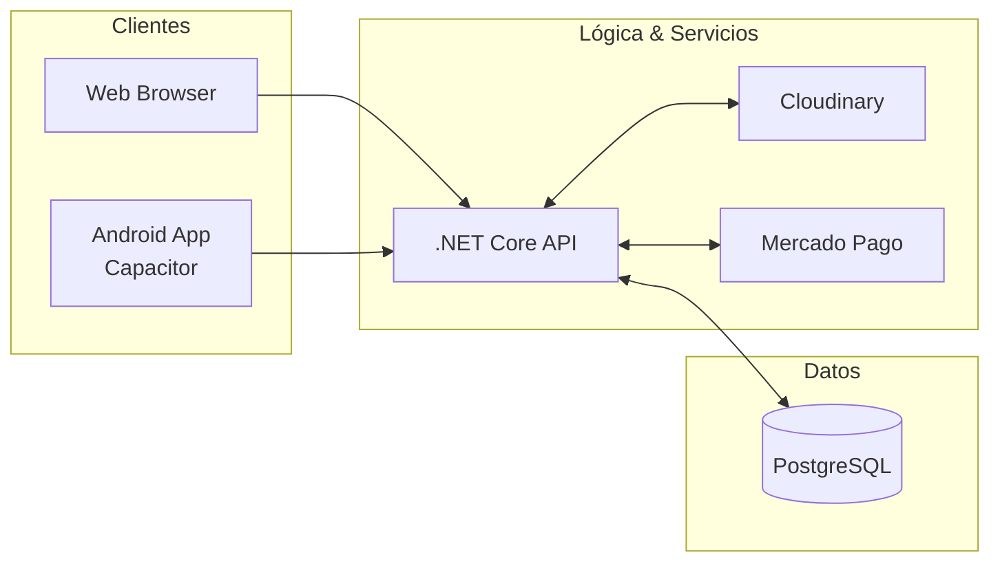

# Resumen Ejecutivo - Sistema SIGDEF

## Visión General del Proyecto

**SIGDEF** (Sistema de Gestión Deportiva Federativa) es una solución ecosistémica integral diseñada para digitalizar la administración de federaciones de canotaje y kayak. Originalmente concebido como una plataforma web, el sistema ha evolucionado para incluir capacidades móviles nativas integrando una arquitectura robusta de backend con interfaces de usuario modernas y responsivas.

## Propósito y Alcance

Digitalizar el ciclo de vida completo de la actividad deportiva federativa:
- **Gestión Institucional**: Clubes afiliados, autoridades y delegados.
- **Capital Humano**: Atletas, tutores (para menores), entrenadores y selección nacional.
- **Ciclo de Competencia**: Creación de eventos, configuración de pruebas/regatas e inscripciones masivas.
- **Ecosistema Financiero**: Automatización de cobros vía Mercado Pago y trazabilidad de transacciones.
- **Gestión de Activos**: Repositorio central de documentación legal y médica vía Cloudinary.
- **Omnicanalidad**: Acceso web para administración y despliegue móvil para usuarios finales.

## Stack Tecnológico 2026

### Frontend & Mobile
| Capa | Tecnología | Propósito |
|-----------|------------------|-----------|
| **Framework** | React 18 / Vite 5 | Core de la interfaz web responsiva |
| **Mobile Bridge** | **Capacitor 6** | Empaquetado nativo para Android/iOS |
| **Mobile IDE** | **Android Studio** | Generación de builds y debugging móvil |
| **Routing** | React Router DOM v6 | Gestión de navegación y protección de rutas |
| **UI Components** | Custom Components | Sistema de diseño propio optimizado para performance |
| **Assets** | Lucide React | Librería de iconografía consistente |

### Backend (Core API)
| Capa | Tecnología | Propósito |
|-----------|------------------|-----------|
| **Runtime** | .NET 8.0 SDK | Entorno de ejecución de alto rendimiento |
| **ORM** | Entity Framework Core | Gestión de persistencia y migraciones |
| **Base de Datos** | PostgreSQL 15 | Almacenamiento relacional y soporte JSON |
| **Seguridad** | JWT + Middleware | Autenticación basada en tokens y seguridad de transporte |
| **Docs** | Swagger / OpenAPI | Documentación interactiva de endpoints |

### Servicios Cloud
| Servicio | Propósito |
|----------|-----------|
| **Cloudinary** | CDN y almacenamiento inteligente de documentación multimedia |
| **Mercado Pago** | Pasarela de pagos integrada para el mercado regional |

## Arquitectura del Ecosistema

## Estado de Desarrollo Técnico

### Módulo de Administración (Federación)
- ✅ Dashboard global de estadísticas.
- ✅ Gestión centralizada de clubes y autoridades.
- ✅ Auditoría de inscripciones y validación de aptos médicos.

### Módulo de Gestión (Clubes)
- ✅ Panel de control personalizado por club.
- ✅ Autogestión de atletas y delegados.
- ✅ Flujo simplificado de inscripción a eventos externos.

### Módulo de Pagos e Imágenes
- ✅ Integración de webhooks para Mercado Pago.
- ✅ Procesamiento asíncrono de imágenes para documentación.

### Módulo Mobile (Novedad)
- 🚧 Preparación de entorno en Android Studio.
- 🚧 Integración de plugins de Capacitor para notificaciones y cámara.

---
*Documento generado desde la perspectiva de desarrollo para el equipo de SIGDEF.*
