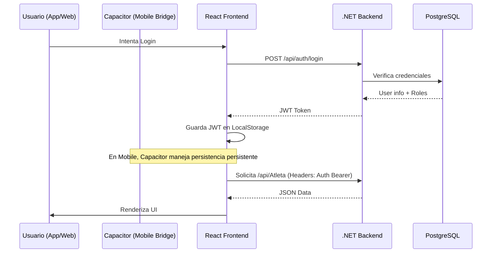

# Arquitectura Técnica - Sistema SIGDEF

## 1. Patrones de Arquitectura Implementados

SIGDEF utiliza un enfoque de **Arquitectura Híbrida** para maximizar la reutilización de código entre la web y dispositivos móviles, manteniendo una separación estricta de responsabilidades en el backend.

### 1.1 Backend: Arquitectura en Capas (N-Layer)
El backend está segmentado en proyectos específicos para desacoplar el dominio del acceso a datos y la interfaz:
- **SIGDEF.Api**: Capa de entrada. Definición de controladores REST, configuración de contenedores de inversión de control (DI) y middlewares de seguridad.
- **SIGDEF.Controlador (Business)**: El núcleo lógico. Contiene los servicios que orquestan las reglas de negocio y los DTOs para la comunicación segura.
- **SIGDEF.AccesoDatos**: Implementación de persistencia. Configuración de Fluent API para Entity Framework y migraciones.
- **SIGDEF.Entidades**: Modelos atómicos de datos y enumeraciones del dominio.

### 1.2 Frontend: Arquitectura Basada en Componentes + Capacitor
El frontend actúa como una **Single Page Application (SPA)** que es "inyectada" en un contenedor nativo:
- **Web**: Despliegue tradicional en navegadores mediante Vite.
- **Mobile**: Utiliza **Capacitor** para exponer APIs nativas (Cámara, GPS, Notificaciones) a la lógica de React a través de un puente JS.

## 2. Diagrama de Flujo de Datos



## 3. Decisiones Técnicas Críticas

### 3.1 Manejo de Ciclos de Referencia en JSON
Debido a la naturaleza relacional de las entidades (ej. Atleta ↔ Club), se configuró en `Program.cs`:
```csharp
options.JsonSerializerOptions.ReferenceHandler = ReferenceHandler.IgnoreCycles;
```
*Justificación*: Permite el intercambio de grafos de objetos complejos sin errores de recursión infinita en la serialización.

### 3.2 Pool de Conexiones a Base de Datos
Uso de `AddDbContextPool` para PostgreSQL:
*Justificación*: SIGDEF espera picos de tráfico durante los cierres de inscripción. El pooling recicla conexiones activas, reduciendo la latencia de apertura de sockets en un 30-40%.

### 3.3 Integración Mobile con Android Studio
El proyecto incluye una carpeta `android` generada por Capacitor. 
- **Namespace**: `com.sigdef.app`
- **Gradle**: Configurado para soportar `Android SDK 34`.
- **Sync**: Se utiliza `npx cap sync` para sincronizar los builds de React con los assets de Android.

## 4. Stack de Comunicación

- **API RESTful**: Todas las operaciones siguen el estándar de verbos HTTP (GET, POST, PUT, DELETE).
- **Multipart Data**: Para el manejo de archivos (DNI/Aptos Médicos), se utiliza `FormOptions` configurado para 10MB para soportar fotos de alta resolución tomadas desde dispositivos móviles.
- **CORS**: Política de "AllowAll" permitida para facilitar la integración con la App móvil y diferentes entornos de desarrollo.

## 5. Middleware Pipeline (.NET)

1. **ExceptionHandler**: Captura errores 500 y devuelve JSON estructurado (evita fugas de stack trace).
2. **Logging**: Registro de cada Request/Response por consola y log.
3. **Security Headers**: Inyección de `X-Frame-Options` y `X-Content-Type-Options`.
4. **Auth**: Validación de JWT Bearer antes de llegar al controlador.

---
*Actualización: Marzo 2026 - Inclusión de sección Mobile/Capacitor.*
