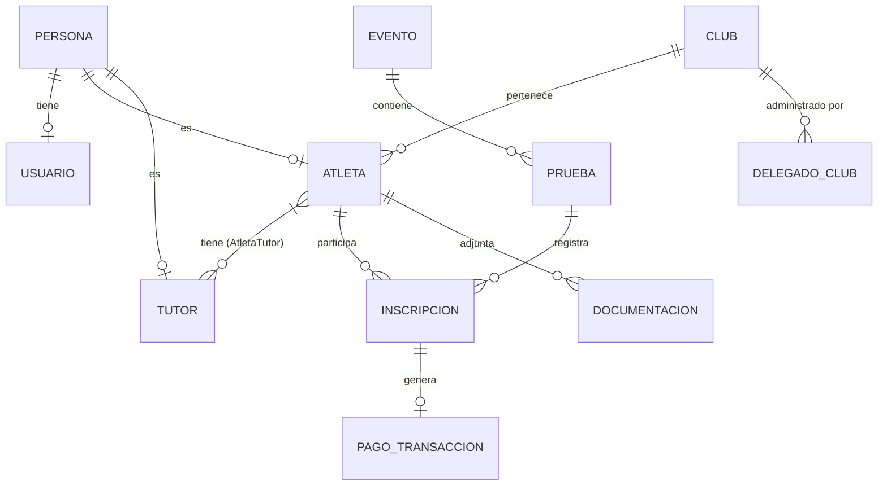

# Modelo de Datos - SIGDEF

## 1. Diccionario de Entidades Principales

El sistema utiliza una estructura relacional optimizada para PostgreSQL. A continuación, el detalle de los objetos de persistencia:

### 1.1 Núcleo de Identidad
- **Persona**: Entidad base compartida. Almacena DNI, Nombre, Apellido, Fecha de Nacimiento, Sexo y Email.
- **Usuario**: Credenciales de acceso asociadas a una Persona. Maneja el Hash de contraseña y el Rol.
- **Rol**: Define los permisos en el sistema (Administrador, Club, Delegado, Entrenador).

### 1.2 Estructura Institucional
- **Club**: Representa a la entidad deportiva. Almacena Nombre, Dirección y el Delegado principal.
- **DelegadoClub**: Entidad de relación que vincula a una Persona con un Club en calidad de autoridad.

### 1.3 Dominio Deportivo
- **Atleta**: Extensión de Persona con datos federativos (Categoría, Estado de Pago, Pertenencia a Selección).
- **Tutor**: Persona responsable de un Atleta menor de edad.
- **AtletaTutor**: Vínculo entre Atleta y Tutor con definición de parentesco.

### 1.4 Operación de Eventos
- **Evento**: Cabecera de la competencia (Nombre, Ubicación, Fecha).
- **Prueba**: Cada una de las regatas dentro de un Evento (Distancia, Tipo de Bote, Categoría, Sexo).
- **Inscripcion**: Registro de un Atleta en una Prueba específica de un Evento.

## 2. Diagrama Entidad-Relación (Mermaid)

## 3. Enumeraciones del Sistema (Enums)

Son fundamentales para mantener la integridad de los datos entre el Backend (.NET) y el Frontend (React).

### 3.1 Categorías Deportivas
| Valor | Etiqueta | Rango de Edad |
|-------|----------|---------------|
| 1 | Preinfantil | 6-9 años |
| 2 | Infantil | 10-12 años |
| 3 | Cadete | 13-14 años |
| 4 | Junior | 15-17 años |
| ... | ... | ... |

### 3.2 Tipos de Bote
- `0`: K1 (Kayak Individual)
- `1`: K2 (Kayak Doble)
- `2`: K4 (Kayak Cuádruple)
- `3`: C1 (Canoa Individual)
- `4`: C2 (Canoa Doble)

### 3.3 Estados de Pago
- `0`: Pendiente
- `1`: Pagado
- `2`: Vencido
- `3`: Parcial

## 4. Reglas de Integridad Digital

1. **Unicidad de DNI**: No pueden existir dos Personas con el mismo número de documento.
2. **Validación de Tutor**: Si un Atleta tiene menos de 18 años al momento de la inscripción, el sistema exige obligatoriamente el vínculo con un Tutor y la carga de la "Autorización de Menor".
3. **Restricción de Prueba**: Un Atleta no puede inscribirse dos veces en la misma Prueba del mismo Evento.

---
*Modelo actualizado base: EF Core Power Tools / PostgreSQL.*
