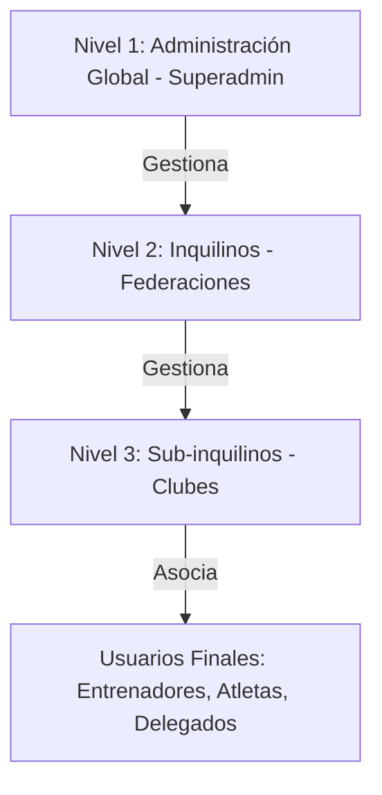

# Matriz de Roles y Permisos - SIGDEF

Este documento detalla la estructura de roles, el alcance de acceso y la matriz de permisos del **Sistema de Gestión Deportiva Federativa (SIGDEF)**. Está diseñado para servir como material de referencia para futuras presentaciones y capacitaciones.

---

## 1. Niveles de Acceso y Arquitectura Multi-Tenant

SIGDEF está estructurado sobre un modelo multi-inquilino (Multi-Tenant) dividido en tres niveles principales:

1. **Nivel Global (Superadmin):** Control total del ecosistema, suscripciones y auditoría general.
2. **Nivel Tenant (Federación):** Control total del deporte federado específico. Gestiona clubes, atletas nacionales, árbitros, eventos oficiales y el cuerpo técnico.
3. **Nivel Sub-Tenant (Clubes):** Control sobre la delegación del club, sus palistas, tutores e inscripciones locales.

---

## 2. Definición de Roles del Sistema

A continuación se detallan los roles soportados en la base de datos (`RolTipo`) y su propósito:

| ID Rol | Nombre Técnico | Etiqueta / Nombre Visual | Descripción y Alcance |
| :---: | :--- | :--- | :--- |
| **1** | `Administrador` | **Superadmin Global** | Propietario del SaaS. Administra federaciones (tenants), suscripciones de pago y registros de auditoría del sistema. |
| **2** | `PresidenteFederacion` | **Administrador de Federación** | Máxima autoridad de una federación específica. Control completo sobre clubes federados, validación documental y configuraciones bancarias. |
| **7** | `Secretario` | **Secretario / Personal Administrativo** | Personal de apoyo en la federación. Posee permisos de lectura y edición de registros deportivos, pero no configuraciones críticas de cuenta. |
| **3** | `DelegadoClub` | **Delegado de Club** | Representante institucional del club ante la federación. Inscribe deportistas en competencias y administra el padrón de su club. |
| **4** | `Entrenador` | **Entrenador de Club** | Diseña los entrenamientos diarios, asocia atletas y realiza un seguimiento deportivo a nivel club. |
| **5** | `EntrenadorSeleccion` | **Entrenador de Selección Nacional** | Gestiona el cuerpo técnico y palistas designados a la Selección Nacional. Coordina categorías y entrenamientos federativos. |
| **6** | `Atleta` | **Deportista / Palista** | Destinatario final de la gestión. Accede principalmente vía app móvil para ver su credencial digital (QR), eventos e historial. |
| **-** | `Tutor` | **Tutor Legal** | Rol asociado a la persona física encargada de un menor de edad (requerido para atletas < 18 años). |

---

## 3. Matriz de Permisos por Módulo

La siguiente matriz detalla las operaciones permitidas por rol en cada módulo de la aplicación web:

| Módulo / Recurso | Superadmin | Admin Federación | Secretario Fed. | Delegado Club | Entrenador | Atleta (App) |
| :--- | :---: | :---: | :---: | :---: | :---: | :---: |
| **Gestión de Federaciones** | `C / R / U / D` | No | No | No | No | No |
| **Planes de Suscripción (SaaS)**| `C / R / U / D` | No | No | No | No | No |
| **Auditoría Global de Eventos** | `R` | No | No | No | No | No |
| **Configuración de Federación (Banco/CUIT)**| No | `C / R / U` | `R` | No | No | No |
| **Gestión de Clubes Afiliados** | No | `C / R / U / D` | `R / U` | No | No | No |
| **Gestión de Usuarios (Accesos)** | No | `C / R / U / D` | `R` | No | No | No |
| **Auditoría Documental (DNI/Apto)**| No | `Aprobar/Rechazar` | `Aprobar/Rechazar` | No | No | No |
| **Entrenadores de Selección** | No | `C / R / U / D` | `R` | No | No | No |
| **Perfil del Club** | No | `R` | `R` | `C / R / U` | No | No |
| **Gestión de Atletas (Club)** | No | `R` | `R` | `C / R / U / D` | `R` | No |
| **Gestión de Tutores** | No | `R` | `R` | `C / R / U / D` | `R` | No |
| **Inscripción a Eventos** | No | `Configurar` | `Configurar` | `Inscribir / Pagar`| No | No |
| **Visualización Credencial (QR)**| No | No | No | `R` | `R` | `R (Propietario)` |
| **Cronograma y Resultados** | No | `C / R / U / D` | `R` | `R` | `R` | `R` |

> [!NOTE]
> **Acrónimos:** `C` (Crear), `R` (Leer), `U` (Actualizar/Editar), `D` (Eliminar).

---

## 4. Mecanismos de Control de Acceso (Enforcement)

El sistema garantiza que estas políticas se cumplan de manera estricta a través de dos capas de seguridad:

### A. Capa de Presentación (Frontend - React)
* **Route Guards (`PrivateRoute`):** Validan el rol mapeado del usuario (`user.role`) antes de renderizar un árbol de rutas. Si el usuario no tiene permisos, se le redirige automáticamente a su correspondiente panel (`/dashboard`, `/club` o `/superadmin`).
* **Sidebars Dinámicos:** Los componentes `Sidebar.jsx`, `SidebarClub.jsx` y `MainLayoutSuper.jsx` se renderizan de forma independiente según el perfil del usuario autenticado, asegurando que no se muestren opciones de menú no autorizadas.
* **Control de Componentes Inline:** Los botones de edición y eliminación se ocultan dinámicamente si el rol del usuario no tiene permisos de escritura sobre la entidad correspondiente.

### B. Capa de Datos y API (Backend - ASP.NET Core)
* **Autenticación mediante JWT:** Al iniciar sesión, la API genera un token JWT firmado criptográficamente que incluye el claim de Rol (`http://schemas.microsoft.com/ws/2008/06/identity/claims/role`), el ID de Federación (`FederacionId`) o ID de Club (`ClubId`).
* **Filtros por Inquilino (Tenant Isolation):** En cada consulta a la base de datos, el backend aplica cláusulas `Where` utilizando los claims extraídos del token JWT (por ejemplo, `f.IdFederacion == userFederacionId` o `a.IdClub == userClubId`), garantizando que un club no pueda leer ni modificar datos de otro club.
* **Atributo `[Authorize]`:** Protege los controladores e impide peticiones anónimas o maliciosas que intenten evadir la interfaz gráfica.

---
*SIGDEF Development Team - Documentación técnica oficial.*
