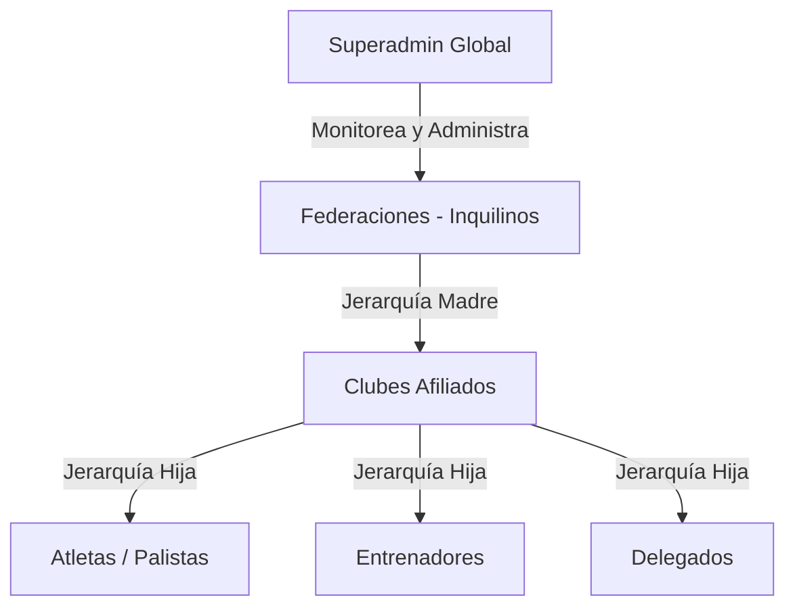

# 📝 Contexto del Proyecto y Lecciones Aprendidas (SIGDEF)

Este documento centraliza el contexto de la aplicación, su arquitectura, el historial de decisiones de diseño y desarrollo, errores corregidos y lecciones aprendidas para evitar redundancias y reducir el consumo de tokens en futuras consultas.

---

## 🚀 1. Contexto General del Proyecto

**SIGDEF (Sistema de Gestión Deportiva Federativa)** es una plataforma SaaS de arquitectura Multi-Tenant diseñada originalmente para la gestión de deportes acuáticos (como el canotaje) y escalable a otras disciplinas.

### 🏢 Estructura de Jerarquía SaaS
El sistema opera bajo un modelo jerárquico estricto para garantizar el aislamiento de datos por federación (inquilino):


### 💻 Stack Tecnológico
*   **Backend:** `.NET Core (v7/v8)` con **C#**.
    *   **ORM:** Entity Framework Core (EF Core) con PostgreSQL.
    *   **Autenticación:** JWT (JSON Web Tokens) y roles integrados por claims.
    *   **Arquitectura:** Controladores, DTOs (Data Transfer Objects), Servicios y Repositorios.
*   **Frontend:** **React** con **Vite** y **Vanilla CSS**.
    *   **Diseño:** Interfaz Premium con modo oscuro/claro, Glassmorphism, y layouts adaptativos nativos.
    *   **Iconografía:** Lucide React.
    *   **Cliente HTTP:** Custom Wrapper Fetch en `src/services/api.js` con soporte para reintentos y timeouts.

---

## 🛠️ 2. Arquitectura de Base de Datos y Modelo SaaS

Para transformar SIGDEF en un ecosistema Multi-Tenant SaaS, se aplicaron cambios estructurales clave:

### 🗄️ Relación Club-Federación
Cada club debe pertenecer obligatoriamente a una sola federación mediante `IdFederacion`.
*   **Script SQL Aplicado:**
    ```sql
    ALTER TABLE "Club" ADD COLUMN IF NOT EXISTS "IdFederacion" INTEGER NULL;
    ALTER TABLE "Club" ADD CONSTRAINT "FK_Club_Federacion_IdFederacion" FOREIGN KEY ("IdFederacion") REFERENCES "Federacion"("IdFederacion") ON DELETE SET NULL;
    ```
*   **Mapeo en EF Core (`SIGDeFContext.cs`):**
    ```csharp
    modelBuilder.Entity<Club>()
        .HasOne(c => c.Federacion)
        .WithMany()
        .HasForeignKey(c => c.IdFederacion)
        .OnDelete(DeleteBehavior.SetNull);
    ```

---

## ⚠️ 3. Historial de Errores Corregidos y Lecciones Aprendidas

Esta sección registra los errores corregidos para evitar volver a caer en ellos en futuros desarrollos.

### 🔐 A. Autenticación y Mapeo de Roles JWT (Frontend)
*   **Error histórico:** El frontend no reconocía correctamente los roles devueltos por el backend debido a que el JWT de .NET utiliza claims con esquemas XML completos para los roles.
*   **Solución en [AuthContext.jsx](file:///c:/Users/EZEQU/source/reposFront/FrontSigdef/src/context/AuthContext.jsx):**
    Se implementó una decodificación que lee tanto el claim estándar `role` como el claim de esquema de Microsoft, mapeándolos a roles estándar en el frontend (`SUPERADMIN`, `FEDERACION`, `CLUB`):
    ```javascript
    const jwtRoleClaim = decoded['http://schemas.microsoft.com/ws/2008/06/identity/claims/role'] || decoded['role'];
    ```
*   **Bypass de Testing:** Se configuró un bypass de login local para el usuario `superadmin`/`superadmin` que genera un token virtual simulado para facilitar el desarrollo sin necesidad de correr el backend localmente en etapas de diseño de UI.

### 📊 B. Optimización de Consultas en Backend y Exportaciones
*   **Error histórico / Potencial Cuello de Botella:** La exportación de datos pesados (Excel) cargando entidades completas con tracking activo saturaba la memoria.
*   **Solución (Documentada en [arreglos.txt](file:///c:/Users/EZEQU/source/repos/SIGDEF-v7-Copia/arreglos.txt)):**
    1.  **Proyecciones DTO:** Utilizar siempre DTOs optimizados con `.Select()` para consultar únicamente las columnas requeridas por el Excel, reduciendo el tráfico de datos y acelerando la respuesta.
    2.  **No Tracking:** Forzar `.AsNoTracking()` en las consultas de exportación para que Entity Framework no mantenga en memoria de cache de entidades los registros leídos:
        ```csharp
        var datos = await _context.Atleta.AsNoTracking().Select(...).ToListAsync();
        ```
    3.  **Abstracción en Servicios:** Registrar `ExcelExportService` como *Scoped* en `Program.cs` en lugar de acoplar lógica pesada directamente en los controladores.

### 🎨 C. Consistencia Estética en Vistas de Lista y Búsqueda
*   **Error de UX:** En versiones iniciales, los inputs de búsqueda diferían en comportamiento y estilo visual.
*   **Lección Aprendida:** Utilizar el componente global de UI `SearchInput` en todas las nuevas pantallas (como `FederacionesManagement` y `Auditoria`), asegurando consistencia en la presentación del campo de filtro interactivo.

---

## 📍 4. Dónde Quedamos (Estado Actual)

### 👑 Portal de Superadmin (Frontend)
Se ha completado la interfaz premium del Superadministrador global bajo `src/pages/SuperAdmin/`:
1.  **Dashboard Global (`SuperDashboard.jsx`):** Tarjetas KPI dinámicas, gráficos de evolución de atletas en SVG nativo responsive y desglose de clientes por planes SaaS.
2.  **Gestión de Inquilinos (`FederacionesManagement.jsx` y `FederacionesForm.jsx`):** CRUD de Federaciones completamente funcional en interfaz, con soporte de sincronización de `localStorage` como fallback reactivo si la base de datos o el backend no responden.
3.  **Auditoría y Bitácora (`Auditoria.jsx`):** Pantalla de monitoreo de seguridad y accesos con logs detallados e IP del operador.
4.  **Facturación (`Suscripciones.jsx`):** Tablas de control de cobros recurrentes de federaciones por sus planes de suscripción.

### 🏢 Panel de Club (Frontend)
*   Integrado completamente con datos reales provenientes de la base de datos (mediante la API de desarrollo local/nube) para:
    *   Dashboard del Club (KPIs de palistas, eventos e inscripciones).
    *   Visualización de información institucional del club.
    *   Listado y eliminación de atletas de la base de datos.
    *   Listado y eliminación de eventos organizados de la base de datos.
    *   Consulta de eventos disponibles programados por otros clubes.

---

## 📋 5. Tareas Pendientes (Qué Falta Hacer)

Para completar el ecosistema al 100%, se requiere avanzar con las siguientes fases:

### 📝 Fase 1: Integración de Formularios (Clubes/Federación)
*   [ ] **`AtletasForm.jsx`**: Conectar los flujos de creación (POST) y edición (PUT) con `/api/Atleta`.
*   [ ] **`EventosForm.jsx`**: Conectar la creación (POST) y edición (PUT) con `/api/Evento`.
*   [ ] **`InscripcionesForm.jsx`**: Implementar el formulario para registrar un atleta a un evento disponible (POST `/api/Inscripcion`).

### 🔌 Fase 2: Backend del Portal de Superadmin
*   [ ] **Persistencia Real de Federaciones:** Asegurar que `FederacionController.cs` persista las acciones de creación y actualización del Superadmin en la tabla `Federacion` de la DB (actualmente depende en parte del localStorage fallback en frontend).
*   [ ] **Modelo de Auditoría:** Crear la entidad `AuditoriaLog` en el backend y su respectivo controller para registrar los eventos de seguridad reales (logins, altas, modificaciones) en la base de datos.
*   [ ] **Módulo de Facturación:** Diseñar el modelo de suscripción y facturación en backend para alimentar la pantalla del Superadmin de cobros mensuales.

### 🔒 Fase 3: Seguridad y Filtrado Multi-Tenant en Producción
*   [ ] **Validación de Credenciales de Club:** Reemplazar el bypass de contraseñas de desarrollo de clubes por validación segura basada en base de datos.
*   [ ] **Filtros del lado del Servidor:** Optimizar el backend para que solo devuelva los atletas del club o federación solicitada según el token JWT, eliminando la práctica actual de traer todos los registros y filtrarlos en el cliente frontend (crítico para la escalabilidad del SaaS).

### 📊 Fase 4: Exportación de Reportes
*   [ ] **Excel de Atletas:** Implementar el endpoint `exportar-excel` de atletas en `AtletaController.cs` utilizando el flujo documentado en `arreglos.txt` mediante EPPlus.
