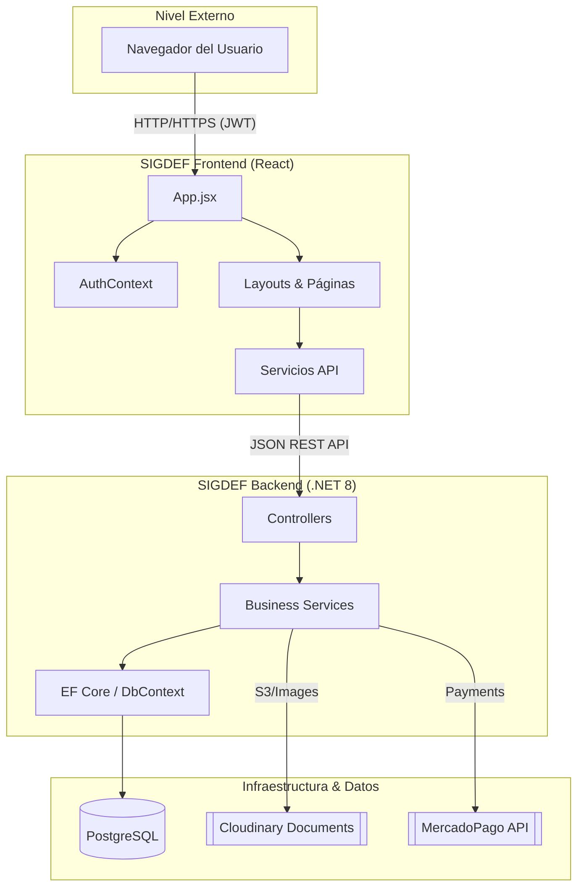

# 🏗️ Arquitectura del Sistema SIGDEF

## Visión General

SIGDEF es una aplicación web de gestión deportiva integral. Utiliza una arquitectura **Single Page Application (SPA)** para el frontend y una **Web API** robusta para el backend, comunicándose de forma segura mediante **JSON** y tokens **JWT**.

## Arquitectura de Alto Nivel

## Capas de la Aplicación

### 1. **Capa de Presentación (Frontend)**
- **Framework**: React 18 con Vite.
- **Enrutamiento**: React Router DOM 6 con protección por roles.
- **Context API**: Manejo del estado global de autenticación y sesión.
- **Estilos**: CSS nativo y CSS Modules para encapsulamiento.

### 2. **Capa de Lógica (Backend)**
- **Tecnología**: ASP.NET Core (.NET 8).
- **Controladores**: 15 controladores que exponen endpoints RESTful.
- **Servicios**: Capa de lógica de negocio desacoplada de los controladores.
- **Seguridad**: Autenticación Bearer basada en JWT.

### 3. **Capa de Datos**
- **Motor**: PostgreSQL.
- **ORM**: Entity Framework Core 8 con migraciones automáticas.
- **Resiliencia**: Reintentos automáticos de conexión (EnableRetryOnFailure).

## Tecnologías y Librerías

### Frontend
- **React 18** - UI Library.
- **Lucide React** - Iconos modernos.
- **CSS Variables** - Sistema de diseño consistente.

### Backend
- **Npgsql** - Proveedor de PostgreSQL para .NET.
- **CloudinaryDotNet** - Gestión de documentación y multimedia.
- **MercadoPago.Net** - Pasarela de pagos integrada.

## Flujo de Datos

### Autenticación & Autorización
1. Usuario envía credenciales.
2. Backend valida y genera un token **JWT**.
3. Frontend guarda el token y expone el estado mediante `AuthContext`.
4. Cada petición posterior al backend incluye el token en el encabezado `Authorization`.

## Decisiones de Arquitectura

- **Separación de Responsabilidades**: Frontend y Backend son proyectos independientes, permitiendo escalabilidad separada.
- **Stateless API**: El servidor no mantiene estado de sesión, todo se maneja mediante el token JWT enviado por el cliente.
- **Cloud First**: Integración nativa con servicios en la nube para escalabilidad (Render, Cloudinary).

---

**Próxima lectura recomendada:** [02-SISTEMA-ROLES.md](./02-SISTEMA-ROLES.md)
