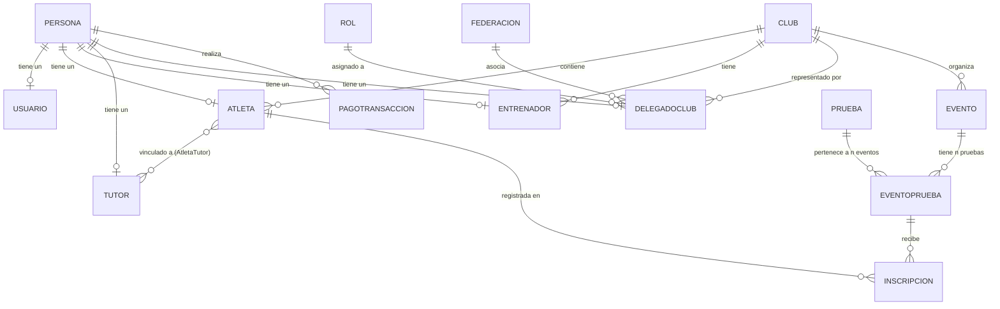

# 🗄️ Documentación de Base de Datos (SIGDEF)

Esta documentación detalla el esquema de la base de datos de SIGDEF, gestionada por **PostgreSQL 16** y el ORM **Entity Framework Core 8**.

## Diagrama de Entidad-Relación (ER)

---

## Diccionario de Tablas Principales

El sistema utiliza nomenclatura en **Singular** para las tablas físicas en la base de datos.

### 1. `Persona`
Base de todos los usuarios del sistema.
- `IdPersona` (PK): Clave primaria autoincremental.
- `Documento`: DNI o pasaporte (Unique).
- `FechaNacimiento`: Fecha en formato UTC.
- `Sexo`: Enum String (Masculino, Femenino, Otro).

### 2. `Atleta`
Entidad central para la gestión deportiva.
- `IdPersona` (FK/PK): Vinculado a `Persona`.
- `IdClub` (FK): Club al que pertenece actualmente.
- `EstadoPago`: Indica si la matrícula está al día (AlDia, Pendiente).
- `Categoria`: Nivel competitivo (ej: Juvenil, Mayor).

### 3. `Club`
Instituciones deportivas registradas.
- `IdClub` (PK): Clave primaria.
- `Siglas`: Nombre corto del club (Unique).
- `EstadoMatricula`: Válido para operar (Activa, Vencida, Pendiente).

### 4. `Inscripcion`
Registro de competencia.
- `IdInscripcion` (PK): Clave primaria.
- `IdAtleta` (FK): Deportista inscrito.
- `IdEventoPrueba` (FK): Vinculación específica entre torneo y disciplina.

---

## Tipos Enumerados (Enums)

Los enums se guardan como **Strings** en la base de datos para facilitar la lectura y el mantenimiento.

- **`EstadoMatricula`**: `Pendiente`, `Activa`, `Vencida`.
- **`EstadoPagoAtleta`**: `Pendiente`, `AlDia`, `Exento`.
- **`CategoriaAtleta`**: `PreInfantil`, `Infantil`, `Cadete`, `Juvenil`, `Mayor`.
- **`Parentesco`**: `Padre`, `Madre`, `TutorLegal`.

## Convenciones de Datos

- **Fechas**: Todas las columnas `DateTime` se almacenan en **UTC**.
- **Booleans**: Se utilizan para estados binarios (ej: `PerteneceSeleccion`).
- **Nulabilidad**: Las claves foráneas son obligatorias excepto en casos específicos (ej: `Atleta` sin club asignado).

## Gestión de Migraciones

La base de datos se mantiene actualizada mediante **EF Core Migrations**. Los comandos se ejecutan desde el proyecto `SIGDeF.AccesoDatos`.

---

**Próxima lectura recomendada:** [06-CASOS-DE-USO.md](./06-CASOS-DE-USO.md)
