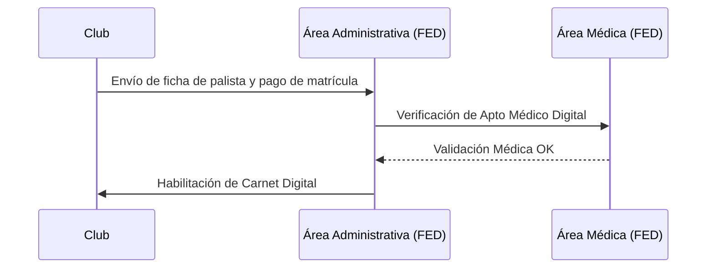

# 🗒️ Etapa de Relevamiento - Federación de Canotaje

## 1. Estructura Organizativa (Organigrama)

A continuación se presenta la estructura jerárquica y funcional de la Federación, escalable para la gestión de múltiples especialidades náuticas.

```mermaid
graph TD
    A[Asamblea General de Clubes] --> B[Comisión Directiva]
    
    B --> C[Presidencia]
    C --> D[Secretaría General]
    C --> E[Tesorería]
    
    B --> F[Comisión Técnica Nacional]
    B --> G[Área Administrativa y Matrículas]
    
    F --> F1[Selectores Nacionales]
    F --> F2[Departamentos por Especialidad]
    
    F2 --> F2a[Sprint (Velocidad)]
    F2 --> F2b[Maratón]
    F2 --> F2c[Slalom]
    F2 --> F2d[Kayak Polo / Otros]
    
    G --> G1[Registro de Clubes]
    G --> G2[Fichaje de Palistas]
    
    B --> I[Área Médica y Seguridad]
    I --> I1[Control de Aptos Médicos]
```

### Descripción de Áreas
*   **Comisión Directiva**: Órgano de decisión política y estratégica.
*   **Comisión Técnica**: Define criterios de selección y normativas deportivas.
*   **Área Administrativa**: Encargada de la gestión de legajos físicos (ahora digitales) de clubes y palistas.
*   **Departamentos por Especialidad**: Coordinan las particularidades técnicas de cada disciplina.

## 2. Procesos Organizacionales Clave

### A. Proceso de Matriculación Anual (Fichaje)
Es el proceso donde un club formaliza la participación de sus palistas para la temporada.



## 3. Problemáticas Detectadas (Puntos de Dolor)

Durante el relevamiento inicial, se identificaron los siguientes desafíos:

1.  **Saturación Administrativa**: El fichaje de cientos de palistas al inicio de temporada genera cuellos de botella por el manejo de documentación en papel/email.
2.  **Inconsistencia de Datos**: Información duplicada o desactualizada entre los registros de los clubes y la federación.
3.  **Gestión de Aptos Médicos**: Dificultad para rastrear vencimientos de certificados de salud, lo que representa un riesgo legal y deportivo.
4.  **Dificultad de Comunicación**: Los clubes carecen de un canal formal para consultar el estado de sus trámites o deudas.

## 4. Necesidades del Usuario

*   **Autogestión de Clubes**: Que el club pueda cargar sus propios palistas y documentos sin depender de un administrativo de la federación.
*   **Trazabilidad**: Saber exactamente quién está habilitado para competir en cada momento.
*   **Centralización**: Un único repositorio digital para toda la documentación (seguros, deslindes, certificados).
*   **Reportes en Tiempo Real**: Estadísticas de participación por club, categoría y región.
