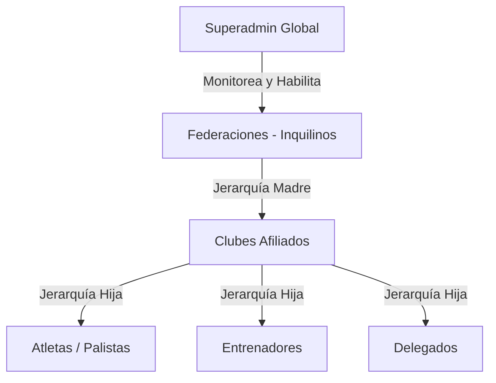

# 13. Arquitectura SaaS Multi-Tenant y Portal de Superadmin

Este documento describe la arquitectura y los detalles técnicos de la transformación de SIGDEF en un sistema multi-inquilino (Multi-tenant SaaS). Esta actualización permite alquilar el sistema a múltiples federaciones deportivas de manera aislada, gobernadas y supervisadas por un rol global de **Superadmin**.

---

## 1. Modelo de Jerarquía SaaS

La estructura de datos sigue una jerarquía estricta que asegura el aislamiento del negocio de cada federación afiliada:



* **Federación (Inquilino):** Es el cliente principal del software. Tiene su propia membresía, su propio panel de configuración y administra un grupo de clubes afiliados de forma completamente aislada de otras federaciones.
* **Club:** Pertenece obligatoriamente a una sola federación (`IdFederacion`).
* **Atleta:** Pertenece a un club y, por ende, a la federación correspondiente.

---

## 2. Modificaciones en la Base de Datos (PostgreSQL)

Para dar soporte a la jerarquía de federaciones, se agregó un vínculo directo entre los clubes y sus respectivas federaciones.

### Script SQL Aplicado:
```sql
-- 1. Agregar columna IdFederacion a la tabla Club
ALTER TABLE "Club" ADD COLUMN IF NOT EXISTS "IdFederacion" INTEGER NULL;

-- 2. Establecer la relación de Foreign Key
ALTER TABLE "Club" 
ADD CONSTRAINT "FK_Club_Federacion_IdFederacion" 
FOREIGN KEY ("IdFederacion") REFERENCES "Federacion"("IdFederacion") 
ON DELETE SET NULL;
```

---

## 3. Cambios en el Backend (.NET Core)

### A. Capa de Entidades
En `SIGDEF.Entidades/Entidades/Club.cs` se agregó la propiedad `IdFederacion` y la relación de navegación virtual:
```csharp
[ForeignKey("Federacion")]
public int? IdFederacion { get; set; }
public virtual Federacion? Federacion { get; set; }
```

### B. Capa de Acceso a Datos
En `SIGDeFContext.cs` se mapeó la relación a través de Fluent API estableciendo la eliminación lógica y nula en cascada:
```csharp
modelBuilder.Entity<Club>()
    .HasOne(c => c.Federacion)
    .WithMany()
    .HasForeignKey(c => c.IdFederacion)
    .OnDelete(DeleteBehavior.SetNull);
```

### C. DTOs y Mapeos de Servicios
Se actualizó `ClubDto.cs`, `ClubCreateDto.cs` y `ClubDetailDto.cs` en la capa de controladores, y se adaptaron los métodos en `ClubServices.cs` (`GetClubes`, `GetClub`, `PostClub`, `PutClub`, `SearchClubes`) para gestionar correctamente el enrutamiento de la federación del club.

---

## 4. Cambios en el Frontend (React - Vite)

### A. Autenticación y Rol `SUPERADMIN`
* **`AuthContext.jsx`**:
  * Decodifica y mapea el rol `'SUPERADMIN'` (o `'SuperAdmin'`) obtenido en las credenciales del payload JWT.
  * Habilita un bypass de pruebas local: si el usuario ingresa las credenciales `superadmin` / `superadmin`, el frontend genera de forma segura una sesión de Superadmin simulada con un token de prueba de duración indefinida.
* **`Login.jsx`**:
  * Se agregaron las credenciales en la tarjeta de información del Login para facilitar las pruebas.

### B. Enrutamiento y Seguridad (`App.jsx`)
Se añadieron las validaciones en `PrivateRoute`, `LoginRoute` y `RootRedirect` para guiar al usuario según su rol de manera segura:
* Un usuario del tipo `SUPERADMIN` es redirigido automáticamente a `/superadmin`.
* Se configuró el árbol de rutas hijas del portal de Superadmin protegidas por rol.

### C. Vistas y Dashboard Premium de Superadmin
Las nuevas páginas se encuentran bajo la ruta `src/pages/SuperAdmin/` y utilizan la estructura estética premium del sistema:
1. **`MainLayoutSuper.jsx`**: Sidebar interactivo con accesos a la gestión de inquilinos, facturación y logs, junto con un menú de usuario y switch de modo oscuro/claro integrado.
2. **`SuperDashboard.jsx`**:
   * **Tarjetas KPI**: Tarjetas interactivas con el volumen global de federaciones, clubes, atletas y cobros de renta activos.
   * **Gráfico SVG Interactivo**: Evolución mensual de registros totales de atletas en la plataforma desarrollada en formato vectorial responsive nativo.
   * **Planes SaaS**: Vista de la distribución de clientes por plan (*Enterprise*, *Premium*, *Básico*).
3. **`FederacionesManagement.jsx` y `FederacionesForm.jsx`**:
   * Panel de control CRUD completo para crear y editar los perfiles de federaciones.
   * Modales de confirmación para eliminaciones y acciones inmediatas de activación/suspensión de cuentas asociadas.
4. **`Suscripciones.jsx`**: Bitácora de facturas del mes, monitoreo de ingresos cobrados e ingresos pendientes de pago del SaaS.
5. **`Auditoria.jsx`**: Bitácora de accesos y seguridad de la plataforma SaaS con filtrados inmediatos por evento.

---

## 5. Credenciales de Prueba del Ecosistema

| Rol | Usuario | Contraseña | Destino en Login |
| :--- | :--- | :--- | :--- |
| **Superadmin Global** | `superadmin` | `superadmin` | `/superadmin` |
| **Federación (Inquilino)** | `admin` | `admin123` | `/dashboard` |
| **Club Afiliado** | `club2` | `club123` | `/club` |

---

## 6. Verificación de Integridad

* **Backend:** Compilación exitosa con `dotnet build` obteniendo **0 errores**.
* **Frontend:** Empaquetado exitoso para producción con `npm run build` completado en **10.13 segundos con 0 errores**, garantizando compatibilidad y carga fluida de todos los nuevos módulos.
