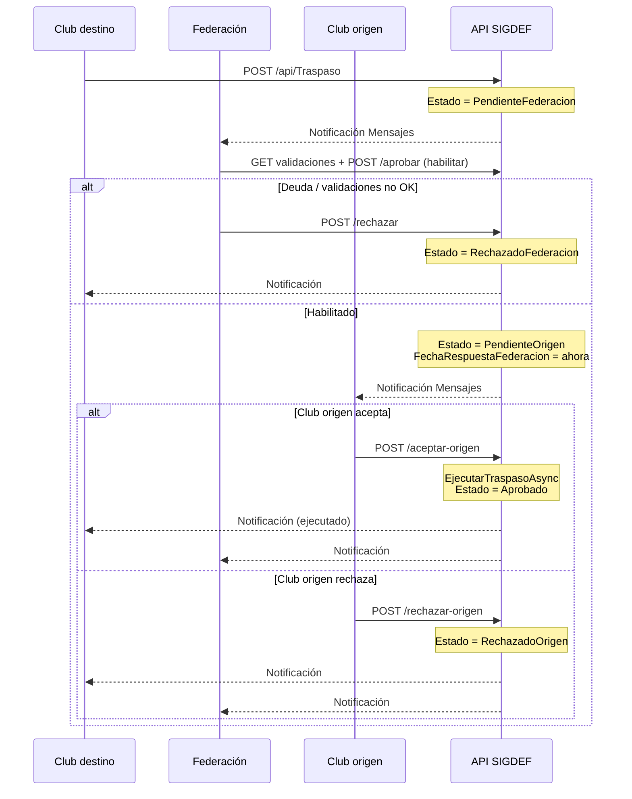

# Flujo de traspasos de atletas (SIGDEF)

> **Versión vigente:** federación verifica deuda **antes** de que el club origen responda.  
> **Fecha:** 2026-07-21  
> **Sistemas:** `Front-Sigdef` + API `SportTrack-Sigdef`  
> **No aplica a:** SportTrack-Front (regatas / timing)

---

## Resumen en una línea

```text
Club destino solicita
  → Federación verifica deuda y habilita (o rechaza)
  → Club origen acepta (ejecuta traspaso) o rechaza
```

---

## Actores

| Actor | Rol en el flujo |
|-------|-----------------|
| **Club destino** | Quiere incorporar al atleta. Crea la solicitud y puede cancelarla mientras esté pendiente. |
| **Federación (Admin)** | Gatekeeper de deuda / validaciones. **Habilita** o **rechaza**. No ejecuta el cambio de club. |
| **Club origen** | Club actual del atleta. Solo actúa **después** de la habilitación federativa. Al aceptar, se ejecuta el traspaso. |

---

## Diagrama de secuencia



---

## Estados

| Estado (API) | Label UI | Quién actúa | Significado |
|--------------|----------|-------------|-------------|
| `PendienteFederacion` | Pendiente verificación fed. | Federación | Recién creada; falta verificar deuda y habilitar |
| `PendienteOrigen` | Pendiente club origen | Club origen | Federación ya habilitó; falta aceptar/rechazar salida |
| `Aprobado` | Aprobado | — | Origen aceptó; `IdClub` ya cambió |
| `RechazadoFederacion` | Rechazado federación | — | Federación rechazó (deuda u otras validaciones) |
| `RechazadoOrigen` | Rechazado origen | — | Club origen no autorizó la salida |
| `Cancelado` | Cancelado | — | Club destino retiró la solicitud |
| `Vencido` | Vencido | — | Reservado (Fase 5; no implementado) |

**Estados activos** (bloquean otra solicitud del mismo atleta): `PendienteFederacion`, `PendienteOrigen`.

### Transiciones

```text
[Crear]
    └─→ PendienteFederacion
            ├─→ (Fed habilita)  PendienteOrigen
            │       ├─→ (Origen acepta)  Aprobado  ★ ejecución aquí
            │       └─→ (Origen rechaza) RechazadoOrigen
            ├─→ (Fed rechaza)   RechazadoFederacion
            └─→ (Destino cancela) Cancelado

PendienteOrigen
    └─→ (Destino cancela) Cancelado
```

---

## Validaciones de la federación

Antes de **Habilitar**, la API evalúa (`GET /api/Traspaso/{id}/validaciones`):

| Código | Descripción | Bloqueante |
|--------|-------------|------------|
| `PERIODO` | Periodo de traspaso vigente | Sí |
| `CLUB_ORIGEN` | Club origen al día / no bloqueado | Sí |
| `CLUB_DESTINO` | Club destino al día / no bloqueado | Sí |
| `ATLETA_AFILIACION` | `PagoAfiliacionAlDia` del participante | Sí |
| `ATLETA_ESTADO_PAGO` | Estado pago SIGDEF (`Pagado` / `Parcial` OK; `Pendiente` / `Vencido` bloquea) | Según estado |
| `INSCRIPCIONES_IMPAGAS` | Sin inscripciones con `Pagado == false` | Sí |

- Si hay ítems bloqueantes en fallo → no se puede habilitar (salvo **Forzar habilitación**, solo SuperAdmin).
- Habilitar **no** cambia el club; solo pasa a `PendienteOrigen` y registra `FechaRespuestaFederacion`.

---

## Ejecución del traspaso

Ocurre solo en `POST /api/Traspaso/{id}/aceptar-origen`, y solo si:

1. Estado = `PendienteOrigen`
2. Existe `FechaRespuestaFederacion` (federación ya habilitó)

En transacción:

1. `AtletasFederados.IdClub` → club destino  
2. `Participantes.IdClub` → club destino  
3. `Participantes.PagoAfiliacionAlDia` → `false`  
4. `AtletasFederados.EstadoPago` → `Pendiente`  
5. Estado solicitud → `Aprobado` + `FechaEjecucion`

---

## Pantallas por rol

### Federación (`/dashboard/traspasos`)

| Filtro / pantalla | Contenido |
|-------------------|-----------|
| **Pendientes verificación** | `PendienteFederacion` — acción principal |
| **Pendientes club origen** | Ya habilitadas; en espera del club |
| Detalle | Checklist + **Habilitar traspaso** / **Rechazar** |
| Periodos | CRUD fechas del periodo |
| Export CSV / Auditoría | Fase 4 |

### Club destino

| Ruta | Contenido |
|------|-----------|
| `/club/traspasos/solicitar` | Buscar atleta y crear solicitud |
| `/club/traspasos/entrantes` | Historial de lo pedido; cancelar si pendiente |

### Club origen

| Ruta | Contenido |
|------|-----------|
| `/club/traspasos/salientes` | Solo `PendienteOrigen` (habilitadas por fed). Aceptar = ejecutar / Rechazar |

> El club origen **no** debe ver solicitudes recién creadas. Si las ve, la API está en el flujo viejo o hay una solicitud legacy sin migrar.

---

## Endpoints clave

| Método | Ruta | Efecto |
|--------|------|--------|
| `POST` | `/api/Traspaso` | Crea → `PendienteFederacion` |
| `GET` | `/api/Traspaso/{id}/validaciones` | Checklist deuda |
| `POST` | `/api/Traspaso/{id}/aprobar?forzar=` | Habilita → `PendienteOrigen` (**no ejecuta**) |
| `POST` | `/api/Traspaso/{id}/rechazar` | → `RechazadoFederacion` |
| `POST` | `/api/Traspaso/{id}/aceptar-origen` | Ejecuta → `Aprobado` |
| `POST` | `/api/Traspaso/{id}/rechazar-origen` | → `RechazadoOrigen` |
| `POST` | `/api/Traspaso/{id}/cancelar` | Destino; solo pendientes |

---

## Notificaciones (Mensajes SIGDEF)

| Evento | Destinatarios |
|--------|---------------|
| Solicitud creada | Admins federación (+ confirmación club destino) |
| Federación habilita | Club origen + club destino |
| Federación rechaza | Club destino |
| Origen acepta (ejecutado) | Club destino + admins federación |
| Origen rechaza | Club destino + admins federación |
| Cancelado | Club origen + admins federación |

No hay email en esta versión.

---

## Solicitudes legacy (flujo anterior)

Antes del cambio (2026-07-21), el orden era: destino → **origen** → federación ejecuta.

Solicitudes creadas en esa ventana pueden quedar en `PendienteOrigen` **sin** `FechaRespuestaFederacion`. Con el código nuevo:

- El club origen **no puede aceptar** (falta OK federación).
- La federación **no actúa** sobre `PendienteOrigen` en la bandeja de verificación.

**Corrección automática:** al listar solicitudes, `HealLegacyPendienteOrigenAsync` pasa esas filas a `PendienteFederacion` para que la federación las habilite o rechace.

Indicador en UI: en el detalle, **Verificación federación = —** y estado ya en club origen ⇒ legacy / API desactualizada.

---

## Criterios de aceptación del flujo

1. Nueva solicitud aparece en federación en **Pendientes verificación**, no en salientes del club origen.  
2. Federacion no habilita si hay deuda bloqueante (salvo forzar SuperAdmin).  
3. Tras habilitar, el club origen ve la solicitud en **Salientes**.  
4. Aceptar origen cambia el club del atleta en ambas tablas.  
5. Rechazo fed o origen deja el atleta en el club original.

---

## Enlaces

| Documento | Uso |
|-----------|-----|
| [Guía usuario paso a paso](../guias-usuario/traspasos-paso-a-paso.md) | Operación diaria |
| [Changelog del cambio de flujo](../cambios/2026-07-traspasos-flujo-federacion-primero.md) | Diff técnico |
| [Plan por fases](../referencia/PLAN_TRASPASOS_ATLETAS.md) | Roadmap Fases 1–5 |
| [Mensajes](../guias-usuario/mensajes.md) | Bandeja de notificaciones |
