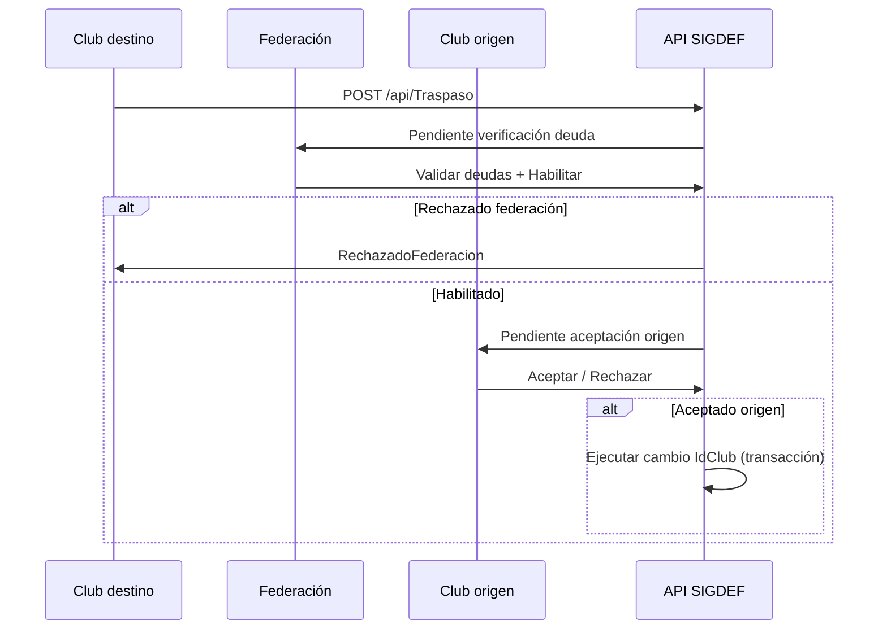

# Plan de implementación — Traspasos de atletas (SIGDEF)

> **Sistema:** SIGDEF (`Front-Sigdef` + API SIGDEF en `SportTrack-Sigdef`)  
> **No incluye:** SportTrack-Front (regatas / timing)  
> **Última actualización:** 2026-07-21  
> **Estado general:** ✅ Fases 1, 2, 3 y 4 completadas  
> **Próxima fase a ejecutar:** **Fase 5** (Reglas avanzadas)

---

## Contexto

Hoy el “traspaso” es un atajo: en `ClubDetalles.jsx` la federación cambia `IdClub` vía `PUT /api/Atleta/{id}` sin solicitud, aprobación del club origen ni validación de deudas.

Este plan reemplaza ese flujo por un **workflow formal de tres actores**:

```text
Club destino solicita → Federación verifica deuda → Club origen acepta/rechaza → cambio de club al aceptar
```

Además existe un **periodo habilitado** (fechas) configurado por la federación.

---

## Reglas de alcance

| ✅ Va en SIGDEF | ❌ No va en SportTrack |
|----------------|------------------------|
| Solicitud / aprobación de traspaso | Módulo de traspasos en `/club` o `/super` |
| Periodos de traspaso (admin fed) | |
| Validación de deudas / afiliación | |
| Bandejas club + federación | |
| Sync `AtletasFederados.IdClub` + `Participantes.IdClub` | |

SportTrack **solo consume** el club actual del atleta para inscripciones a regatas.

---

## Flujo objetivo



---

## Estados de solicitud

| Estado | Descripción |
|--------|-------------|
| `PendienteFederacion` | Esperando verificación de deuda (federación) |
| `RechazadoOrigen` | Club origen no autoriza (tras habilitación) |
| `PendienteOrigen` | Federación habilitó; falta OK club origen |
| `Aprobado` | Origen aceptó; traspaso ejecutado |
| `RechazadoFederacion` | Federación rechazó por deuda u otras validaciones |
| `Cancelado` | Club destino retiró la solicitud |
| `Vencido` | Plazo de respuesta vencido (Fase 5) |

---

## Seguimiento de fases

| Fase | Nombre | Estado | Depende de |
|------|--------|--------|------------|
| **1** | Backend SIGDEF (base + workflow) | ✅ Completada | — |
| **2** | UI Federación | ✅ Completada | Fase 1 |
| **3** | UI Club | ✅ Completada | Fase 1 |
| **4** | Notificaciones e integración | ✅ Completada | Fases 2 y 3 |
| **5** | Reglas avanzadas | 🔲 Pendiente | Fase 4 |

**Leyenda:** 🔲 Pendiente · 🔄 En curso · ✅ Completada

> Al terminar una fase: cambiar su estado aquí, registrar entregables en [../cambios/](../cambios/) y marcar checkboxes abajo.

---

## Fase 1 — Backend SIGDEF (base + workflow)

**Estado:** ✅ Completada  
**Objetivo:** API funcional con workflow completo; sin UI o con pruebas vía Swagger/Postman.

**Changelog:** [2026-07-traspasos-fase1-backend.md](../cambios/2026-07-traspasos-fase1-backend.md)

### Entregables

- [x] Migración EF: tablas `PeriodoTraspaso` y `SolicitudTraspaso` (schema `federacion`)
- [x] Enum `EstadoSolicitudTraspaso`
- [x] `TraspasoController` en `Controllers/SIGDEF/`
- [x] `ITraspasoService` / `TraspasoService` en `Controladores/Federaciones/` (o carpeta dedicada)
- [x] Endpoints:
  - [x] `GET/POST/PUT /api/Traspaso/periodos` (Admin)
  - [x] `GET /api/Traspaso/periodo-activo`
  - [x] `GET /api/Traspaso` (scope por rol)
  - [x] `GET /api/Traspaso/{id}`
  - [x] `GET /api/Traspaso/{id}/validaciones` (checklist deudas)
  - [x] `POST /api/Traspaso` (club destino)
  - [x] `POST /api/Traspaso/{id}/aceptar-origen`
  - [x] `POST /api/Traspaso/{id}/rechazar-origen`
  - [x] `POST /api/Traspaso/{id}/aprobar` (Admin)
  - [x] `POST /api/Traspaso/{id}/rechazar` (Admin)
  - [x] `POST /api/Traspaso/{id}/cancelar` (club destino)
- [x] `TraspasoService.EjecutarAsync`: transacción que actualiza **ambos**:
  - `federacion.AtletasFederados.IdClub`
  - `regatas.Participantes.IdClub`
- [x] Validaciones backend:
  - [x] Periodo vigente
  - [x] Una solicitud activa por atleta
  - [x] Origen ≠ destino; misma federación
  - [x] `EstadoPago` / `PagoAfiliacionAlDia` clubes y atleta
  - [x] Inscripciones impagas (`Inscripcion.Pagado == false`) — bloqueo o advertencia
- [x] Bloquear `PUT /api/Atleta/{id}` con cambio de `IdClub` para rol **CLUB**
- [x] Admin federación: override de emergencia con auditoría
- [x] Registro DI en `Program.cs`
- [x] Documentar contratos en Swagger / nota en `docs/cambios/`

### Criterios de aceptación

1. Club destino puede crear solicitud solo dentro del periodo activo.
2. Club origen puede aceptar/rechazar; federación ve solo las aceptadas.
3. Federación no puede aprobar si hay deuda bloqueante (según reglas definidas).
4. Al aprobar, ambas tablas de club quedan sincronizadas.
5. Rol CLUB no puede cambiar `IdClub` directo por API.

### Archivos de referencia (estado actual)

| Qué | Dónde |
|-----|--------|
| Traspaso informal hoy | `Front-Sigdef/src/pages/FederacionAdmin/Clubes/ClubDetalles.jsx` |
| PUT atleta SIGDEF | `SportTrack-Sigdef/Controllers/SIGDEF/AtletaController.cs` |
| Sync participante | `Controladores/Federaciones/AltaAtletaService.cs` → `EnsureAtletaFederacionAsync` |
| Pagos / deudas | `Participante.PagoAfiliacionAlDia`, `AtletaFederacion.EstadoPago`, `Club.PagoAfiliacionAlDia` |

---

## Fase 2 — UI Federación (`Front-Sigdef` /dashboard)

**Estado:** ✅ Completada  
**Objetivo:** La federación configura periodos y da el OK final.

**Changelog:** [2026-07-traspasos-fases2-3-ui.md](../cambios/2026-07-traspasos-fases2-3-ui.md)

### Entregables

- [x] `src/pages/FederacionAdmin/Traspasos/PeriodosTraspaso.jsx` — CRUD fechas
- [x] `src/pages/FederacionAdmin/Traspasos/TraspasosBandeja.jsx` — pendientes de aprobación
- [x] `src/pages/FederacionAdmin/Traspasos/TraspasoDetalle.jsx` — checklist + Aprobar/Rechazar
- [x] `src/services/traspasoService.js`
- [x] Rutas en `App.jsx` (`/dashboard/traspasos`, …)
- [x] Item **Traspasos** en `Sidebar.jsx`
- [x] Deprecar / redirigir flujo instantáneo en `ClubDetalles.jsx` hacia solicitud formal

### Criterios de aceptación

1. Admin crea periodo con fecha inicio/fin; fuera de rango no se pueden crear solicitudes.
2. Bandeja muestra solicitudes en `PendienteFederacion` con datos de atleta, origen, destino.
3. Detalle muestra validaciones de deuda antes de aprobar.
4. Aprobar/rechazar actualiza estado y refleja en listado sin recargar manual.

---

## Fase 3 — UI Club (`Front-Sigdef` /club)

**Estado:** ✅ Completada  
**Objetivo:** Clubes gestionan traspasos entrantes y salientes.

### Entregables

- [x] `src/pages/ClubAdmin/Traspasos/TraspasosSolicitar.jsx` — buscar atleta de otro club
- [x] `src/pages/ClubAdmin/Traspasos/TraspasosEntrantes.jsx` — mis solicitudes enviadas
- [x] `src/pages/ClubAdmin/Traspasos/TraspasosSalientes.jsx` — aceptar/rechazar salidas
- [x] Rutas en `App.jsx` (`/club/traspasos`, …)
- [x] Item **Traspasos** en `SidebarClub.jsx`
- [x] Badge / indicador de pendientes (similar a mensajes)
- [x] Mensajes de error si periodo cerrado

### Criterios de aceptación

1. Club destino busca atleta por documento/nombre (solo otros clubes, misma fed).
2. Club origen ve solicitudes pendientes y puede aceptar/rechazar con motivo.
3. Club destino ve historial y estados de sus solicitudes.
4. Sin periodo activo: UI bloqueada con mensaje claro.

---

## Fase 4 — Notificaciones e integración

**Estado:** ✅ Completada  
**Objetivo:** Visibilidad del trámite sin entrar al módulo.

**Changelog:** [2026-07-traspasos-fase4-notificaciones.md](../cambios/2026-07-traspasos-fase4-notificaciones.md)

### Entregables

- [x] Notificaciones vía módulo **Mensajes** existente al cambiar estado
- [ ] (Opcional) Email al delegado / admin club — no implementado
- [x] Export CSV de traspasos por temporada (admin)
- [x] Historial / auditoría visible en bandeja federación
- [x] Guía de usuario en `docs/guias-usuario/traspasos-paso-a-paso.md`

### Criterios de aceptación

1. Club origen recibe aviso al llegar solicitud nueva.
2. Club destino y federación reciben aviso al cambiar estado relevante.
3. Admin puede exportar traspasos de un periodo.

---

## Fase 5 — Reglas avanzadas

**Estado:** 🔲 Pendiente  
**Objetivo:** Reglas federativas finas y edge cases.

### Entregables

- [ ] Plazo de respuesta club origen (ej. 7 días → `Vencido`)
- [ ] Bloqueo si atleta tiene inscripciones a eventos **EnCurso** (consulta API SportTrack o flag compartido)
- [ ] Traspaso masivo (varios atletas, una solicitud)
- [ ] Política de `EstadoPago` / cuota al llegar al club destino
- [ ] Reportes por club / temporada
- [ ] Criterios de aceptación en `docs/criterios/traspasos-atletas.md`

### Criterios de aceptación

1. Solicitud vencida no puede aprobarse sin acción admin.
2. Reglas de inscripciones activas documentadas y aplicadas en backend.
3. Política de pago post-traspaso acordada y implementada.

---

## Orden de ejecución recomendado

```text
Fase 1 (backend)
    ├── Fase 3 (UI club — quien inicia)
    └── Fase 2 (UI federación — quien cierra)
            └── Fase 4 (notificaciones)
                    └── Fase 5 (avanzado)
```

Ejecutar **de a una fase**. No avanzar a la siguiente hasta cumplir criterios de aceptación y actualizar el estado en este documento.

---

## Decisiones pendientes (definir antes o durante Fase 1)

| # | Pregunta | Propuesta default |
|---|----------|-------------------|
| 1 | ¿Más de una solicitud activa por atleta? | **No** |
| 2 | ¿Al transferir, resetear `PagoAfiliacionAlDia` en destino? | **Sí** (cuota nuevo club) |
| 3 | ¿Inscripciones futuras al mover club? | **No se mueven**; quedan en historial origen |
| 4 | ¿Quién puede iniciar? | Solo **club destino** |
| 5 | ¿Plazo respuesta origen? | 7 días → `Vencido` (Fase 5) |

---

## Enlaces

| Recurso | Ruta |
|---------|------|
| **Flujo vigente (canónico)** | [../casos-de-uso/traspasos-atletas-flujo.md](../casos-de-uso/traspasos-atletas-flujo.md) |
| Guía usuario | [../guias-usuario/traspasos-paso-a-paso.md](../guias-usuario/traspasos-paso-a-paso.md) |
| Backend compartido | `SportTrack-Sigdef` |
| Front SIGDEF | `Front-Sigdef` |
| Estados evento SportTrack (no confundir) | `SportTrack-Sigdef/docs/tecnico/estados-eventos-fases-sporttrack.md` |
| Changelog por fase | `Front-Sigdef/docs/cambios/` |

---

## Historial de ejecución

| Fecha | Fase | Notas |
|-------|------|-------|
| 2026-07-21 | Flujo | Federación verifica deuda antes que club origen |
| 2026-07-21 | 4 | Notificaciones Mensajes, export CSV, auditoría, guía usuario |
| 2026-07-21 | 2 y 3 | UI federación + club; endpoint buscar-atletas |
| 2026-07-21 | 1 | Backend workflow completo |
