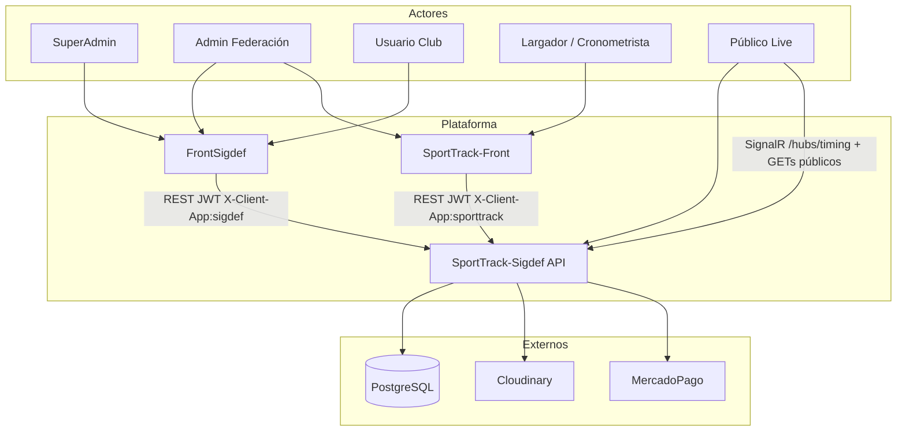
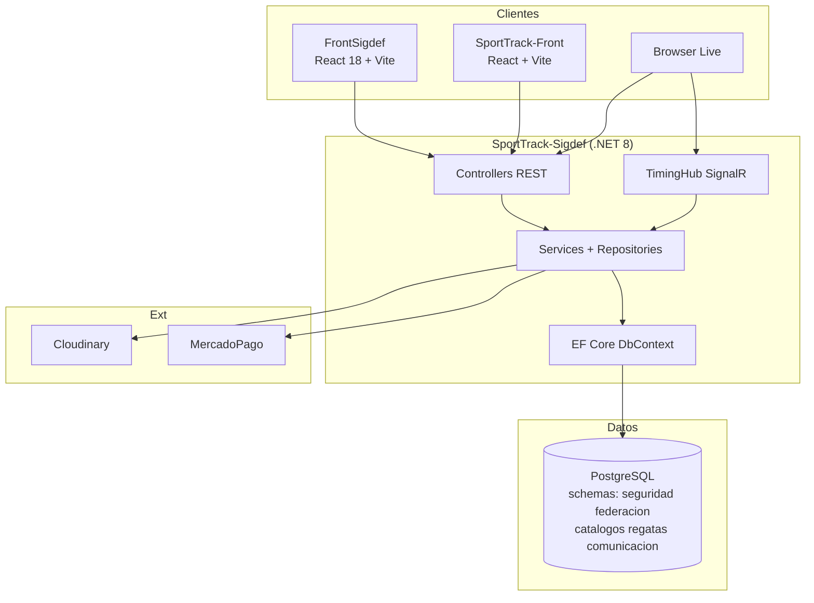
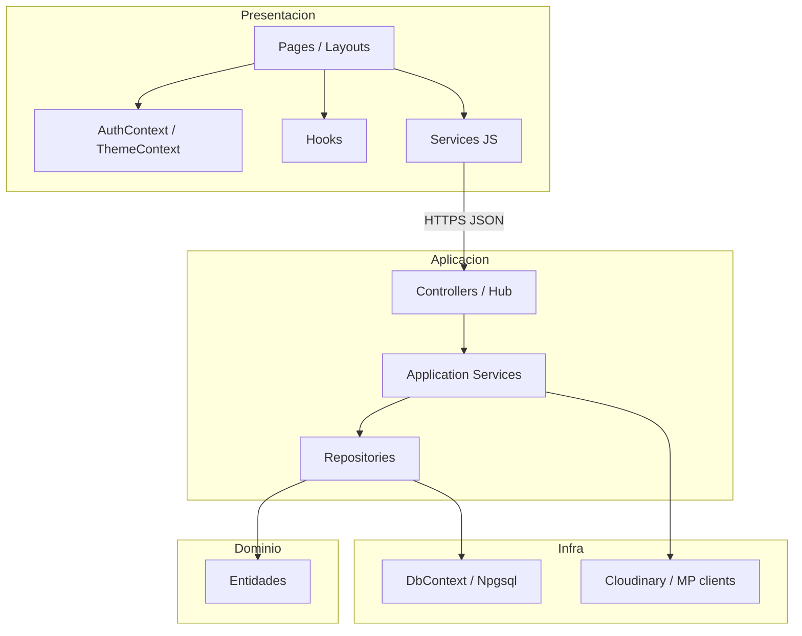
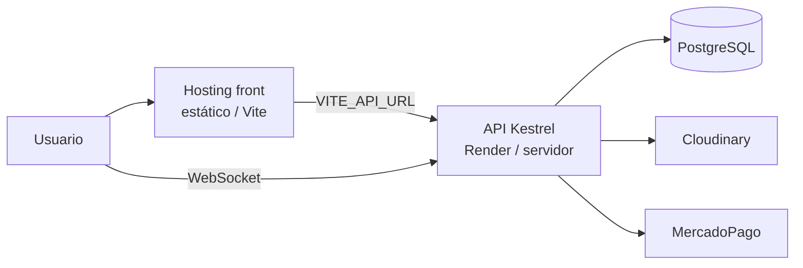
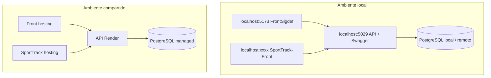
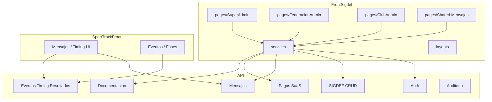
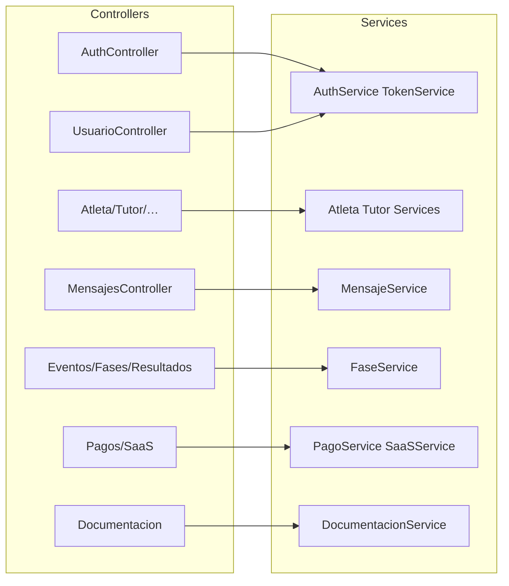
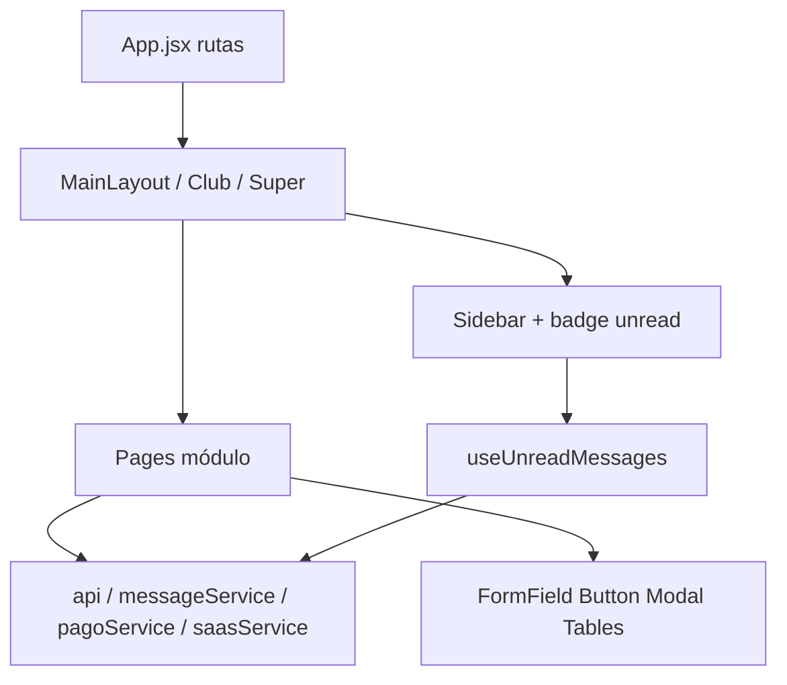

# 01 — Diagramas globales (arquitectura)

## 1. Contexto

---

## 2. Contenedores

---

## 3. Capas

---

## 4. Despliegue

---

## 5. Despliegue detallado (opcional)

**Notas ops**

- Migraciones EF al arrancar (`MigrateAsync`).
- Secrets: JWT, connection string, `CLOUDINARY_*`, MercadoPago.
- Header `X-Client-App` obligatorio en mensajería.

---

## 6. Paquetes / módulos

---

## 7. Componentes (C4 L3) — API

### Componentes — FrontSigdef

