# 02 — Casos de uso, actividad y estados

## 1. Casos de uso

### Vista global por actor

```mermaid
flowchart TB
    SA((SuperAdmin))
    AF((Admin Fed))
    CL((Club))
    LG((Largador/Cronometrista))
    PU((Público))

    SA --> S1[Gestionar federaciones]
    SA --> S2[Planes y suscripciones SaaS]
    SA --> S3[Auditoría]
    SA --> S4[Mensajes a admins]

    AF --> A1[ABM clubes]
    AF --> A2[ABM atletas / tutores / entrenadores / delegados]
    AF --> A3[Gestión de accesos y contraseñas]
    AF --> A4[Eventos e inscripciones]
    AF --> A5[Pagos afiliación]
    AF --> A6[Mensaje 1:1 y comunicado masivo]
    AF --> A7[Documentación personas]

    CL --> C1[Gestionar atletas / tutores del club]
    CL --> C2[Eventos propios y disponibles]
    CL --> C3[Leer y responder mensajes]
    CL --> C4[Delegados del club]

    LG --> L1[Timing de fases / resultados]
    PU --> P1[Ver Live de carreras]
```

### Casos de uso — Mensajería (detalle)

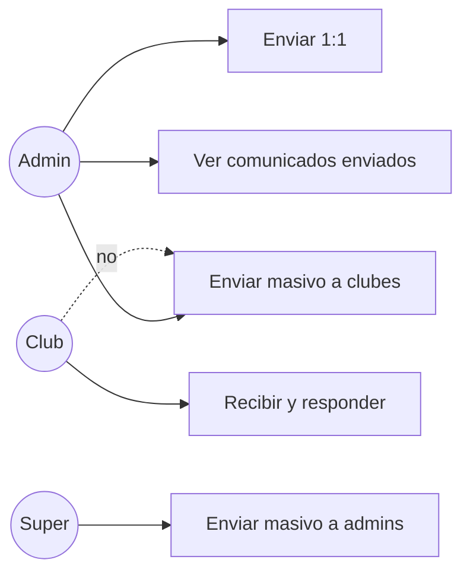

---

## 2. Actividad

### Login

```mermaid
flowchart TD
    A[Abrir /login] --> B[Enviar credenciales]
    B --> C{¿Válidas?}
    C -->|No| D[Incrementar intentos / error]
    D --> A
    C -->|Sí| E{¿Activo / no bloqueado pago?}
    E -->|No| F[Rechazo con motivo]
    E -->|Sí| G[Emitir JWT]
    G --> H{Rol}
    H -->|SUPERADMIN| I[/superadmin]
    H -->|ADMIN/FED| J[/dashboard]
    H -->|CLUB| K[/club]
```

### Alta tutor con vínculo a menor (Fed)

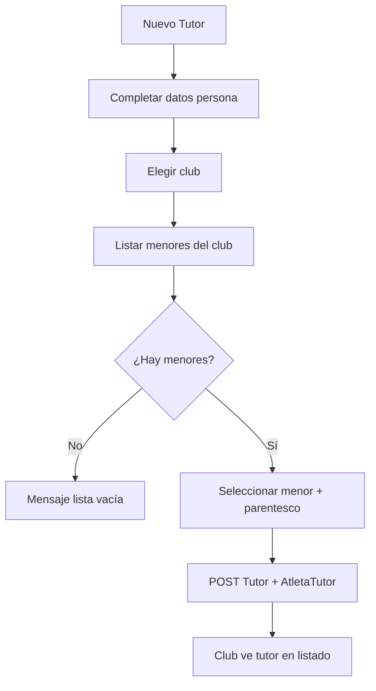

### Comunicado masivo SIGDEF

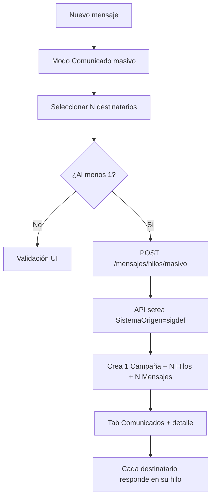

### Inscripción a evento (resumen)

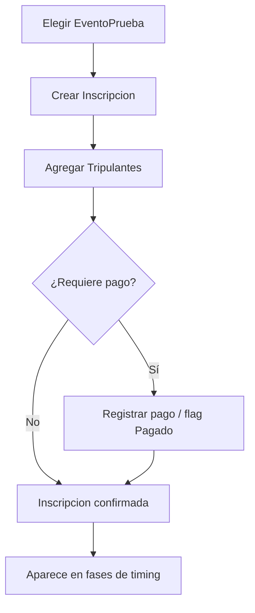

### Timing Live (carrera)

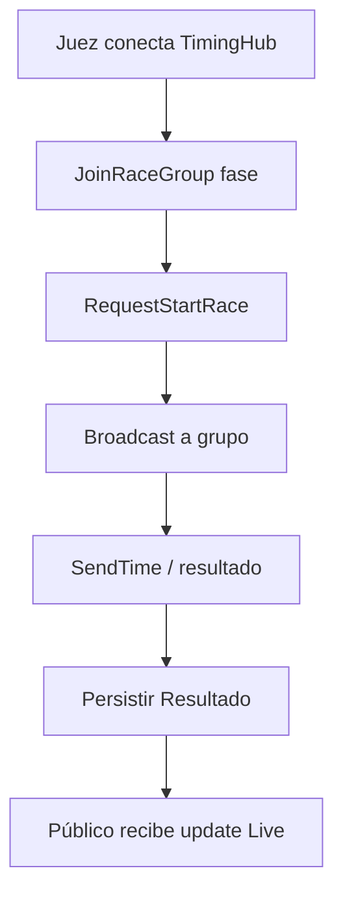

---

## 3. Estados

### Usuario acceso

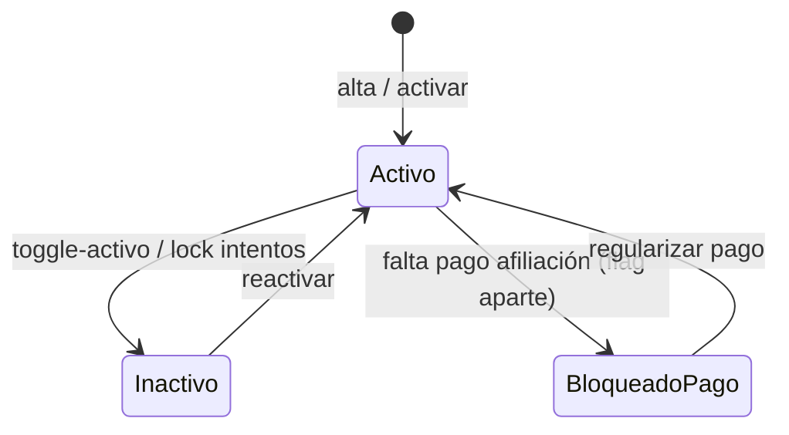

### Mensaje en hilo

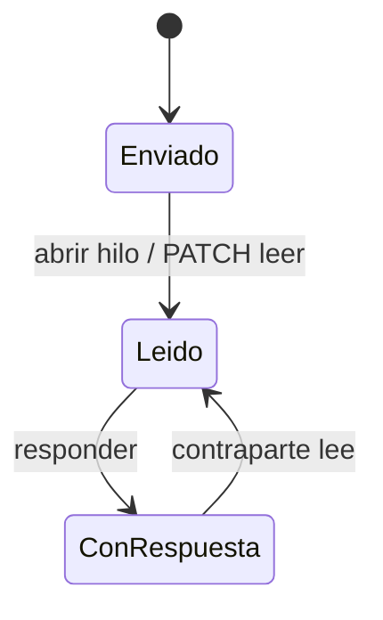

### Campaña

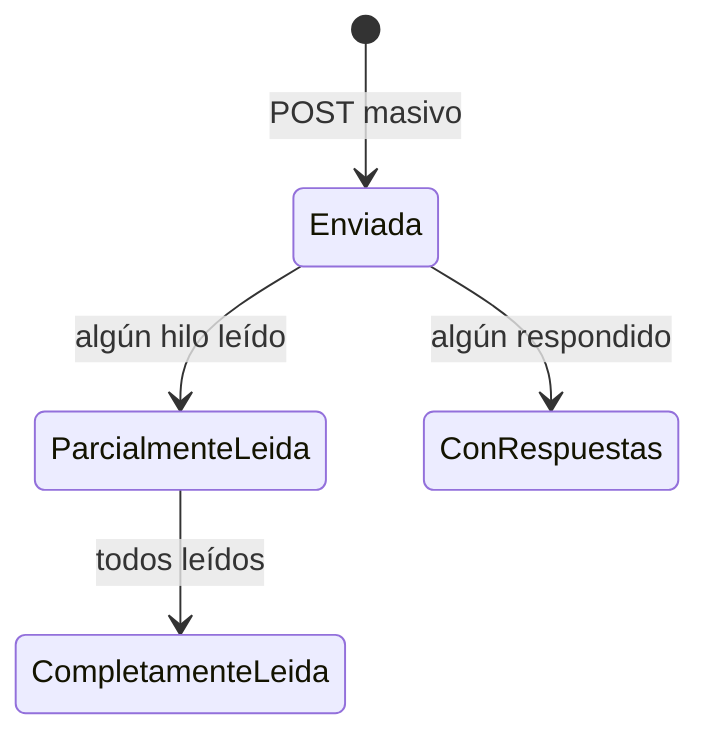

### Fase de regata

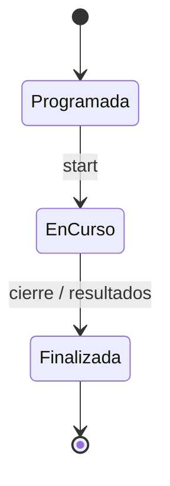

### Inscripción

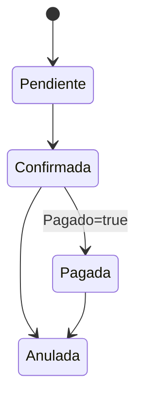

### Matrícula / afiliación club (resumen)

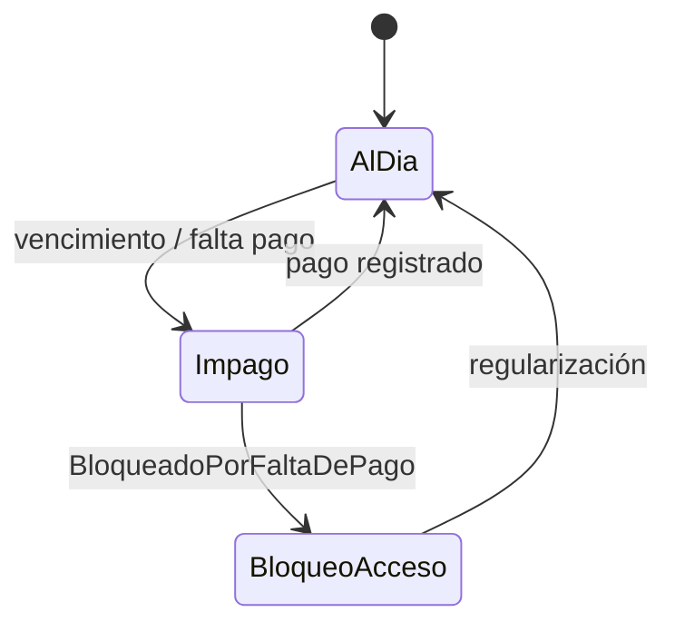

### Documentación persona

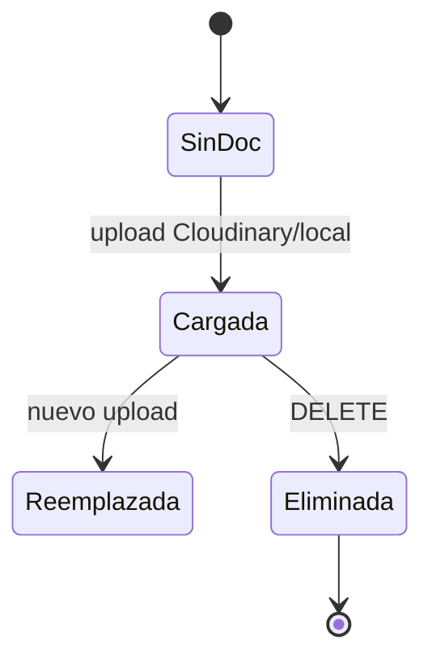
