# 03 — ER y clases de dominio

Schemas PostgreSQL: `seguridad`, `federacion`, `catalogos`, `regatas`, `comunicacion` (+ `Auditoria` sin schema).

---

## 1. ER — Auth / seguridad

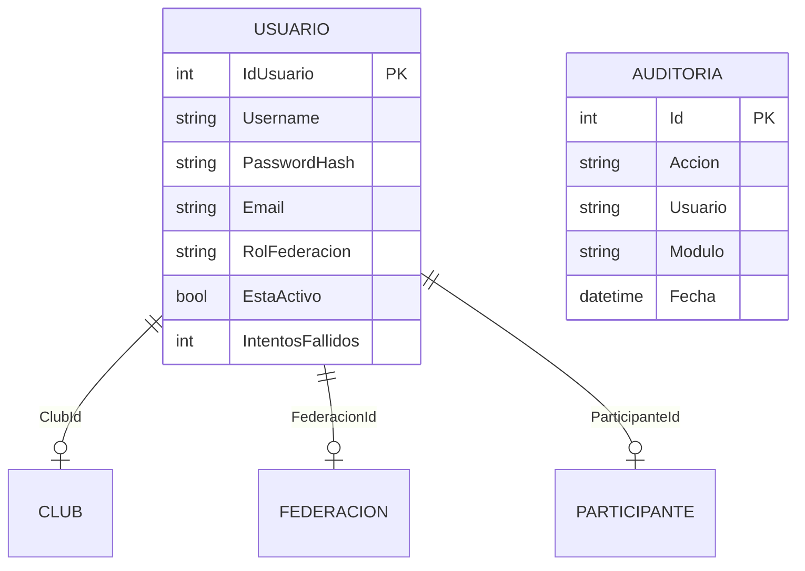

---

## 2. ER — Federación / Club / SaaS

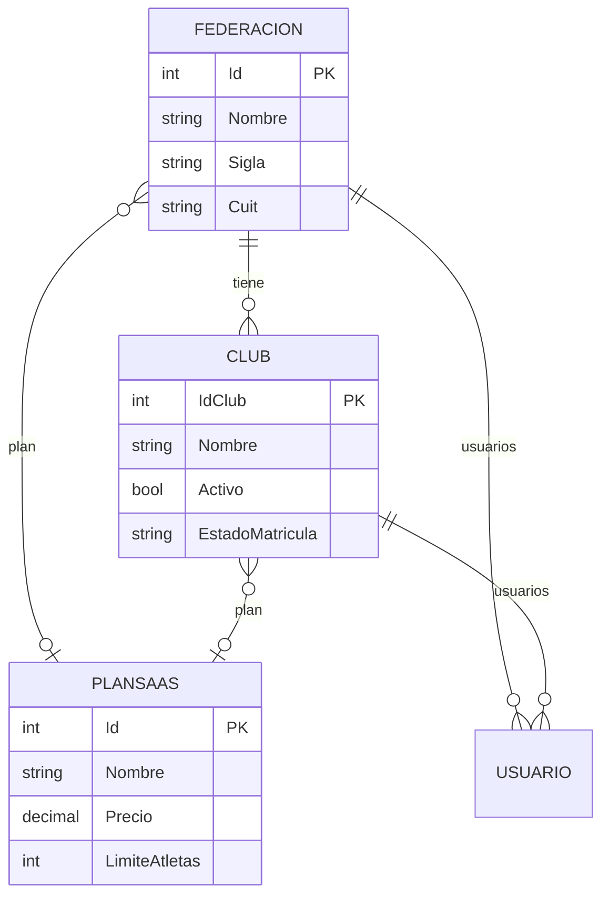

---

## 3. ER — Personas federadas

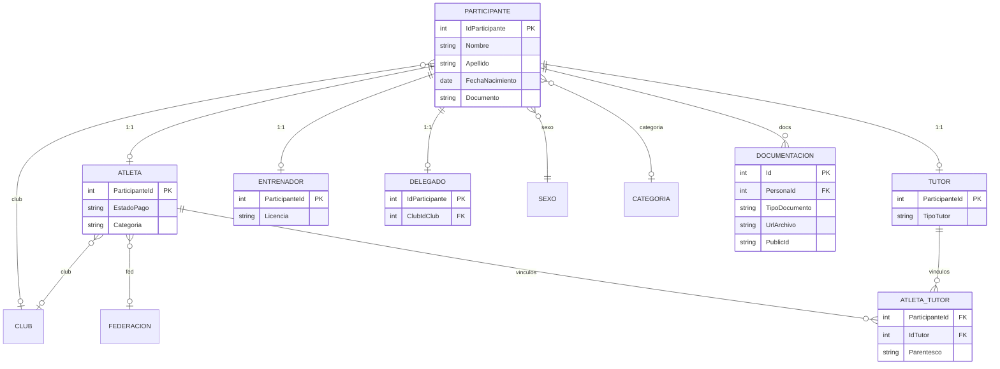

---

## 4. ER — Eventos / timing / resultados

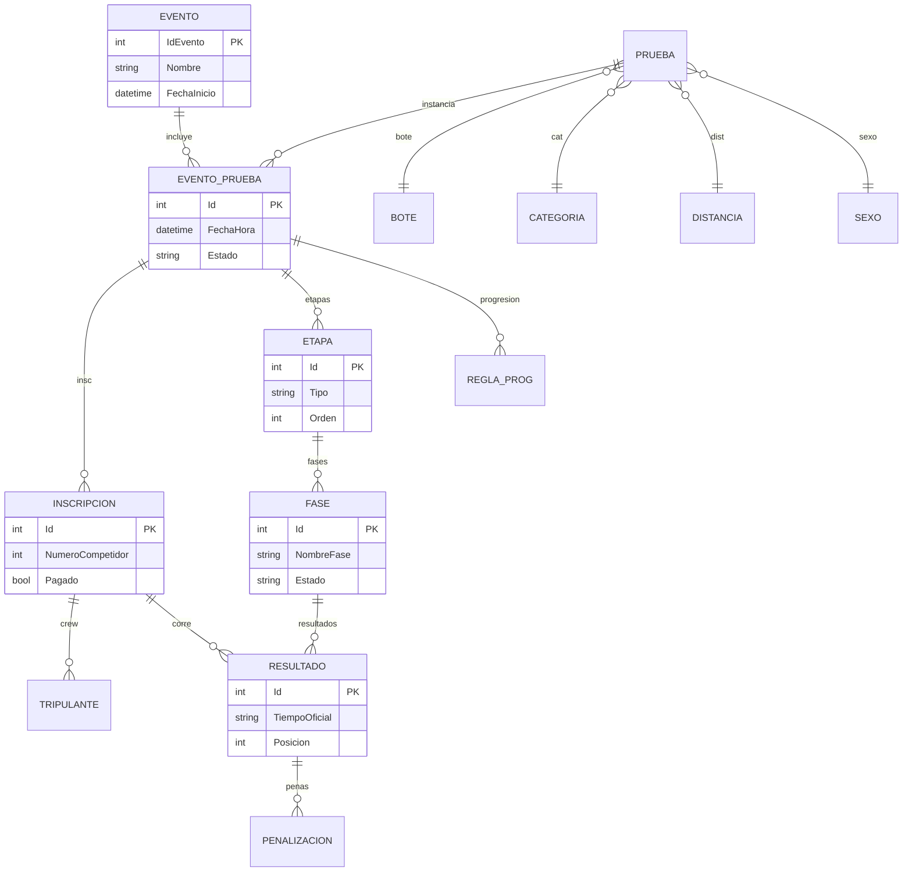

---

## 5. ER — Mensajería

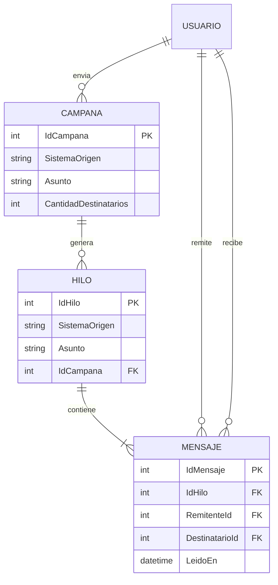

---

## 6. ER — Pagos

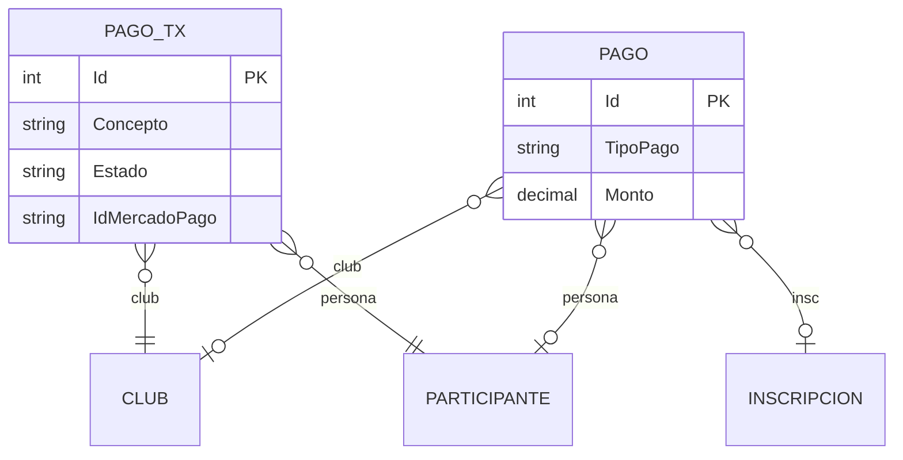

---

## 7. Clases de dominio — Auth

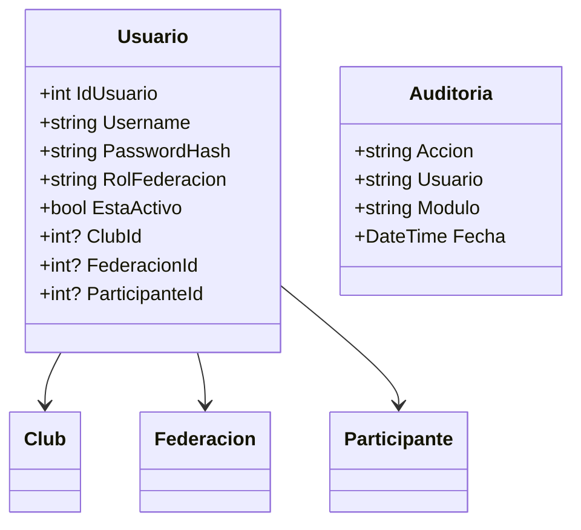

---

## 8. Clases de dominio — Federación / Club

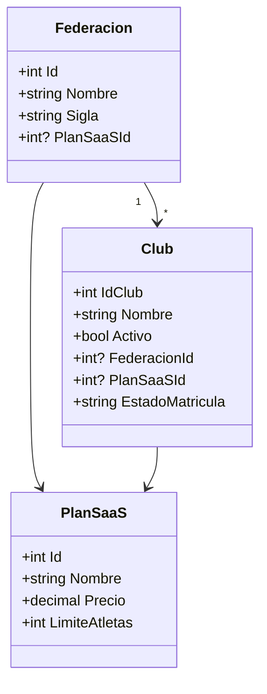

---

## 9. Clases de dominio — Personas

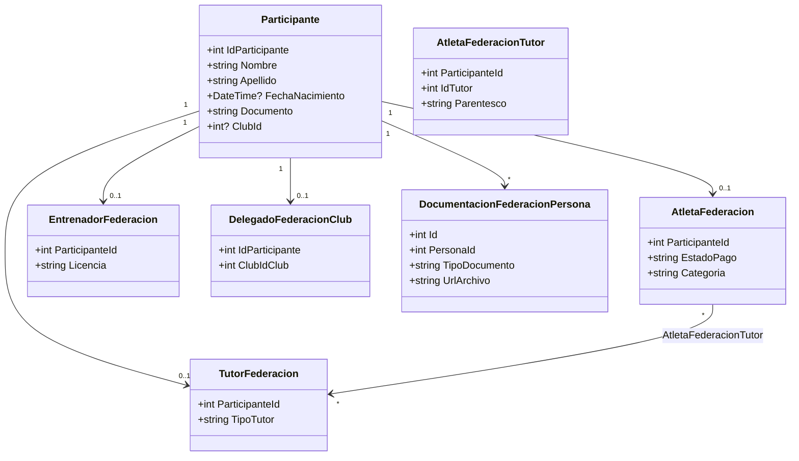

---

## 10. Clases de dominio — Eventos / timing

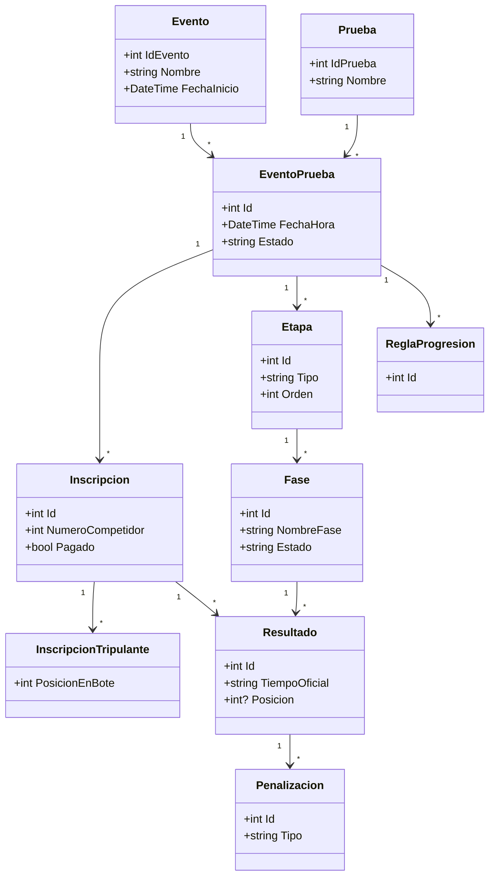

---

## 11. Clases de dominio — Mensajería

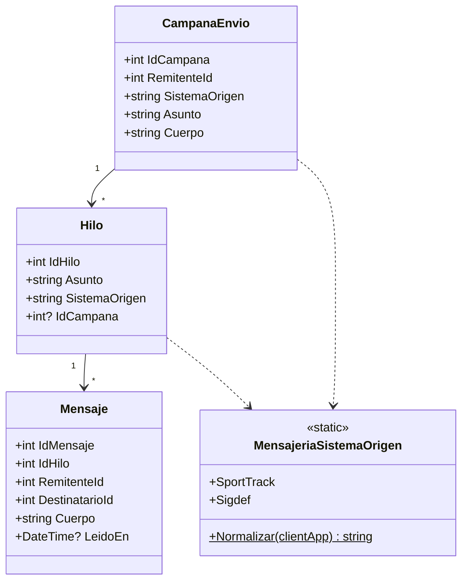

---

## 12. Clases de dominio — Pagos

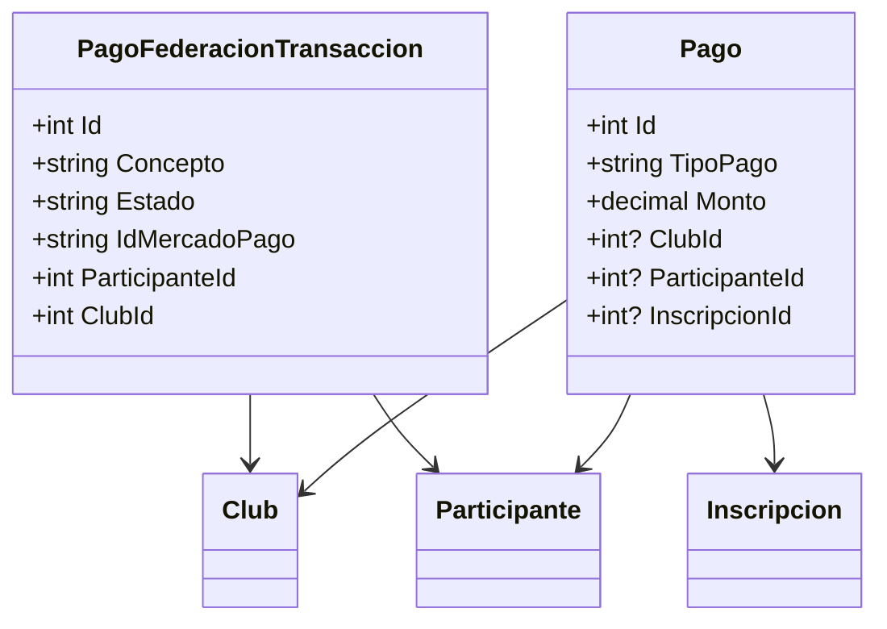

---

## 13. Mapa de schemas (vista de datos)

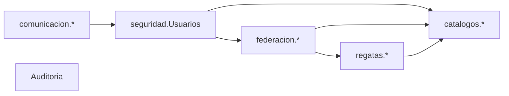
