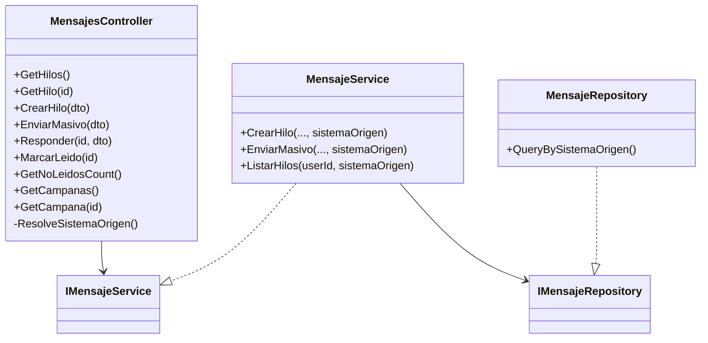
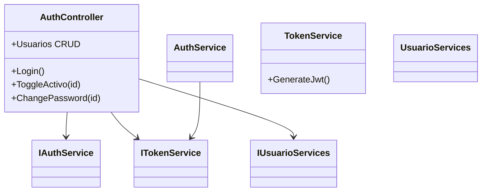
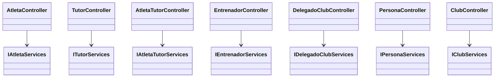
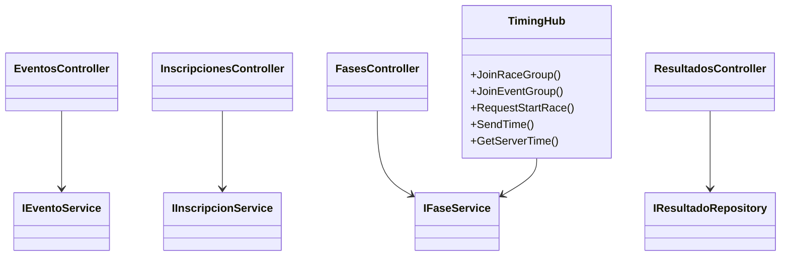
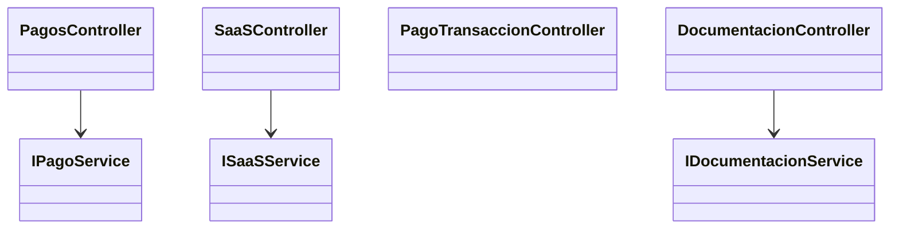
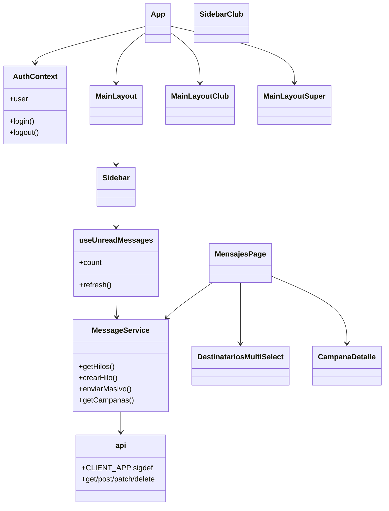
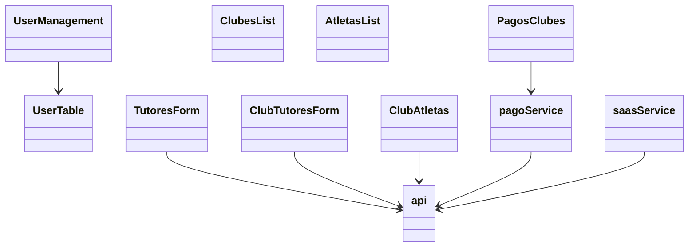
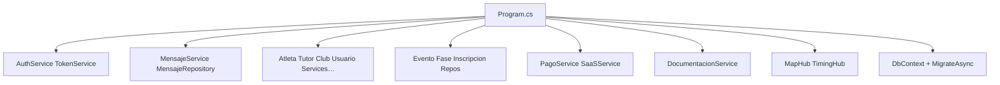

# 04 — Clases de aplicación (opcional)

Vista de **código de aplicación** (no dominio). Útil para onboarding de desarrolladores.

---

## 1. API — Mensajería

---

## 2. API — Auth / usuarios

---

## 3. API — Personas SIGDEF (patrón típico)

---

## 4. API — Eventos / timing

---

## 5. API — Pagos / SaaS / Docs

---

## 6. FrontSigdef — shell y mensajería

---

## 7. FrontSigdef — módulos Fed / Club (vista)

---

## 8. DI (Program.cs) — registro conceptual

