# 05 — Secuencias y vista de red / API

## Red / API {#red-api}

### Mapa de fronteras HTTP

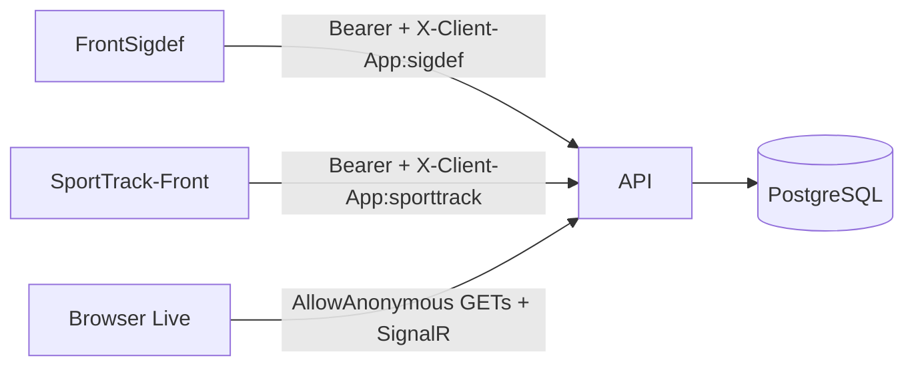

### Grupos de endpoints

| Prefijo | Uso |
|---------|-----|
| `/api/Auth` | Login, usuarios, password, toggle-activo |
| `/api/Atleta`, `/Tutor`, `/Club`, `/Usuario`, … | CRUD SIGDEF |
| `/api/mensajes` | Hilos, campañas, unread |
| `/api/Eventos`, `/Fases`, `/Resultados`, … | Regatas / timing |
| `/api/Pagos`, `/SaaS`, … | Cobros y planes |
| `/api/Documentacion` | Upload Cloudinary |
| `/hubs/timing` | SignalR Live |

---

## 1. Login

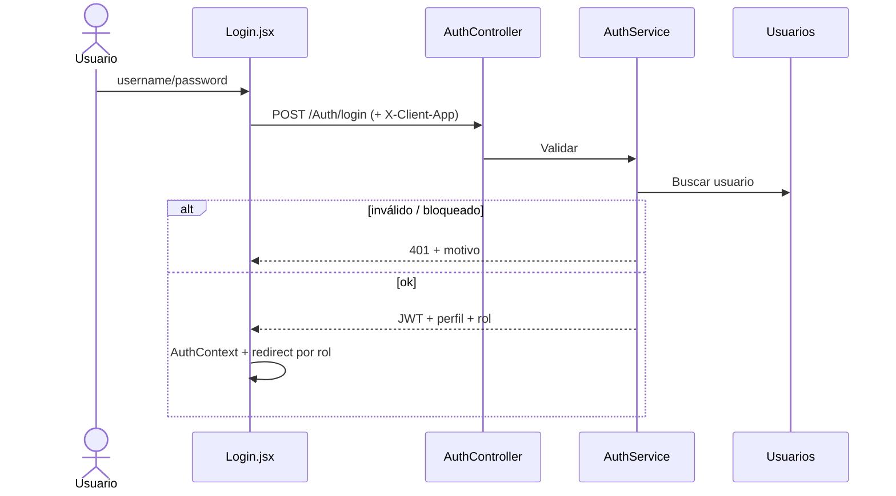

---

## 2. Cambio de contraseña (Admin)

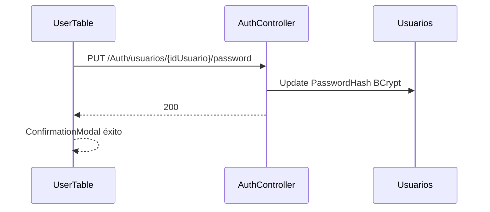

---

## 3. Mensaje 1:1 SIGDEF

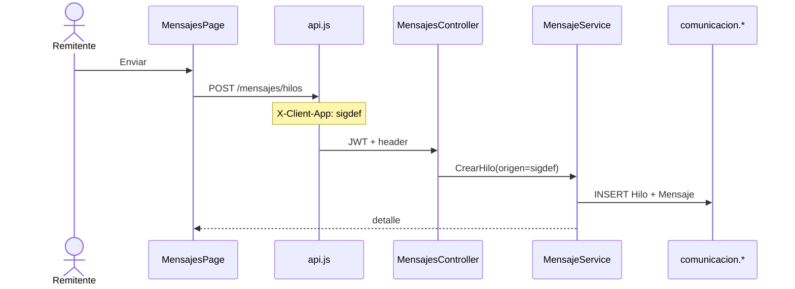

---

## 4. Comunicado masivo

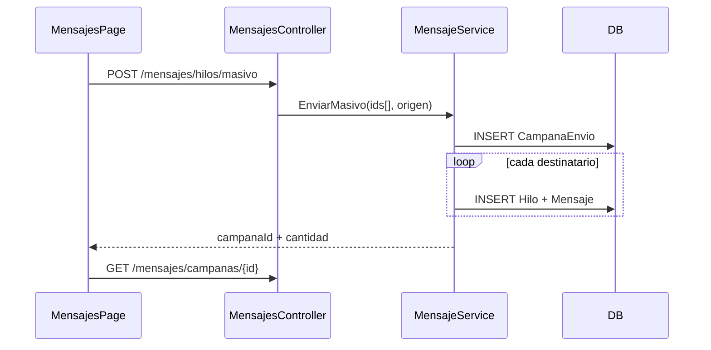

---

## 5. Aislamiento cruzado

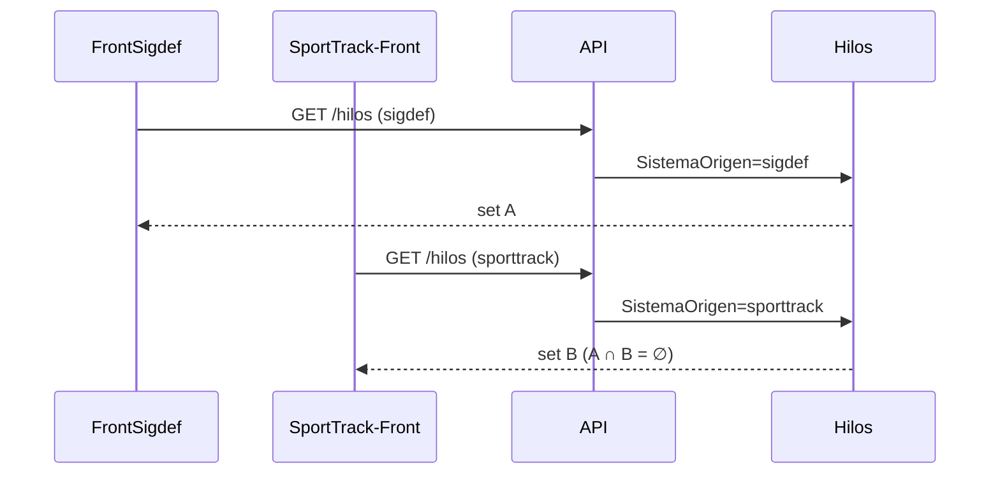

---

## 6. Unread badge

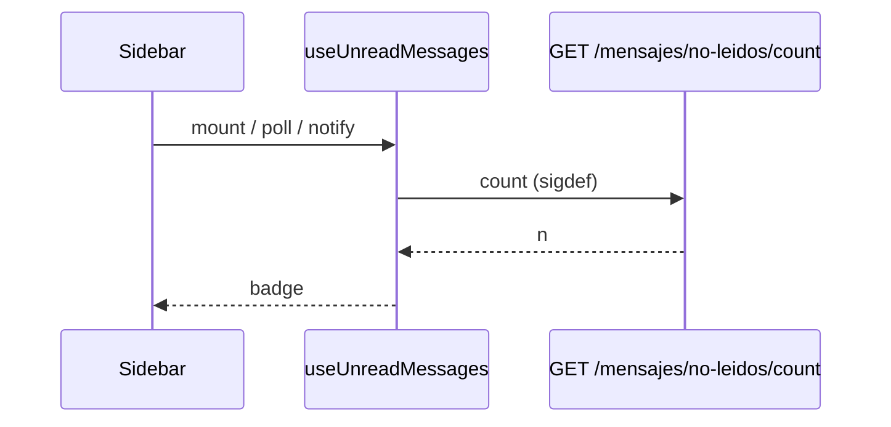

---

## 7. Alta tutor + vínculo

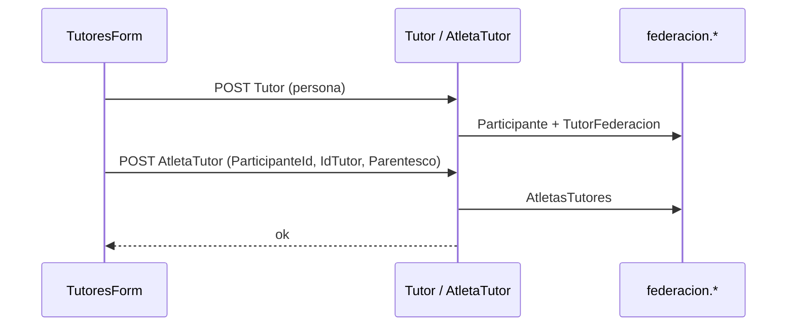

---

## 8. Upload documentación

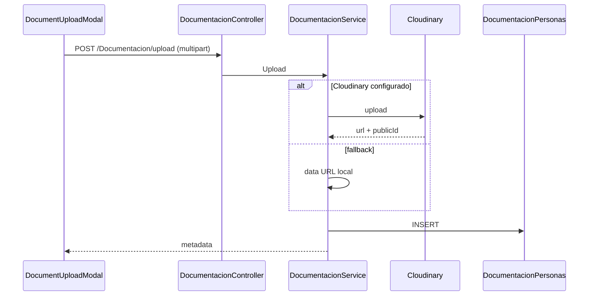

---

## 9. Pago / bloqueo (resumen)

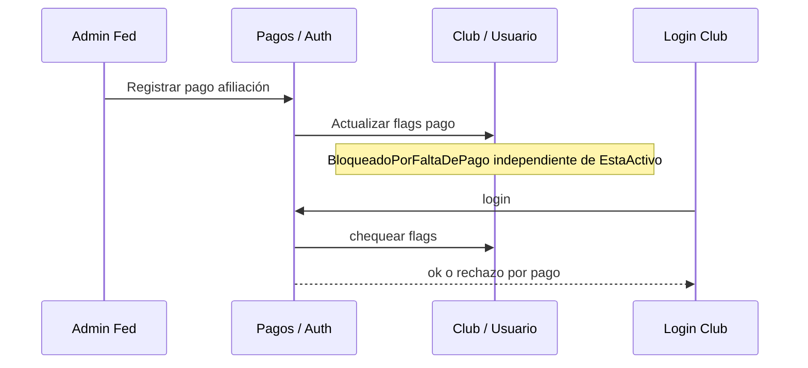

---

## 10. Timing Live

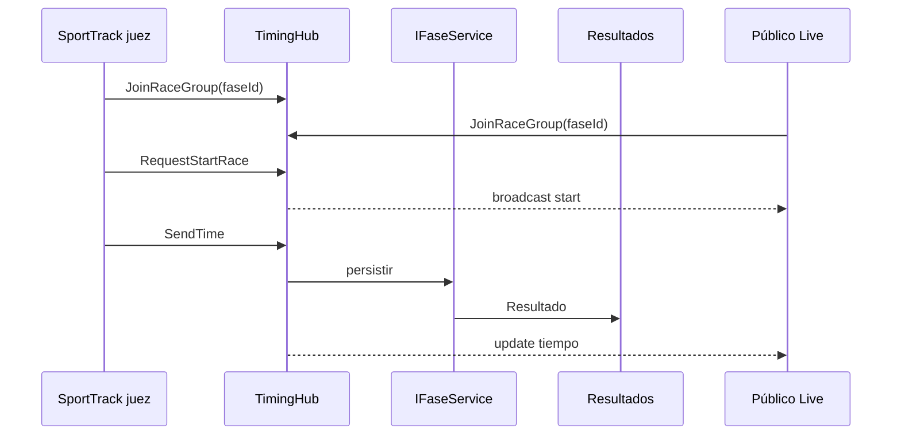

---

## 11. Inscripción a EventoPrueba

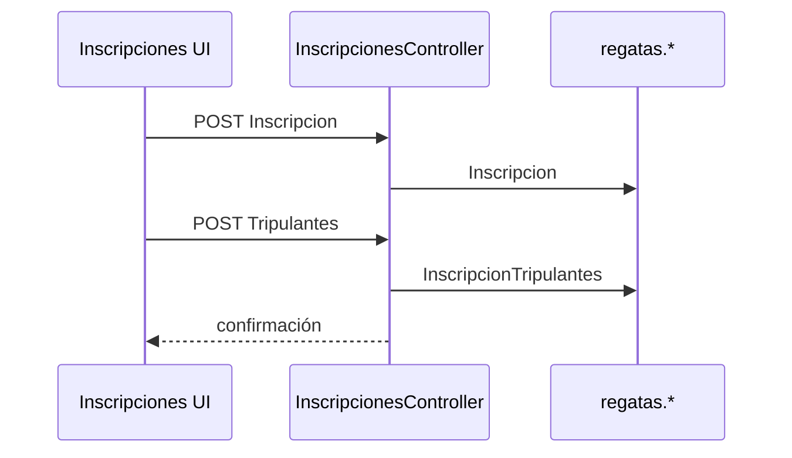

---

## 12. SuperAdmin — métricas SaaS

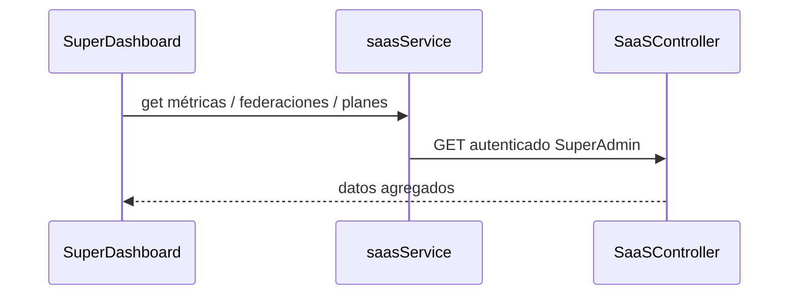

---

## 13. Error path mensajería (suave)

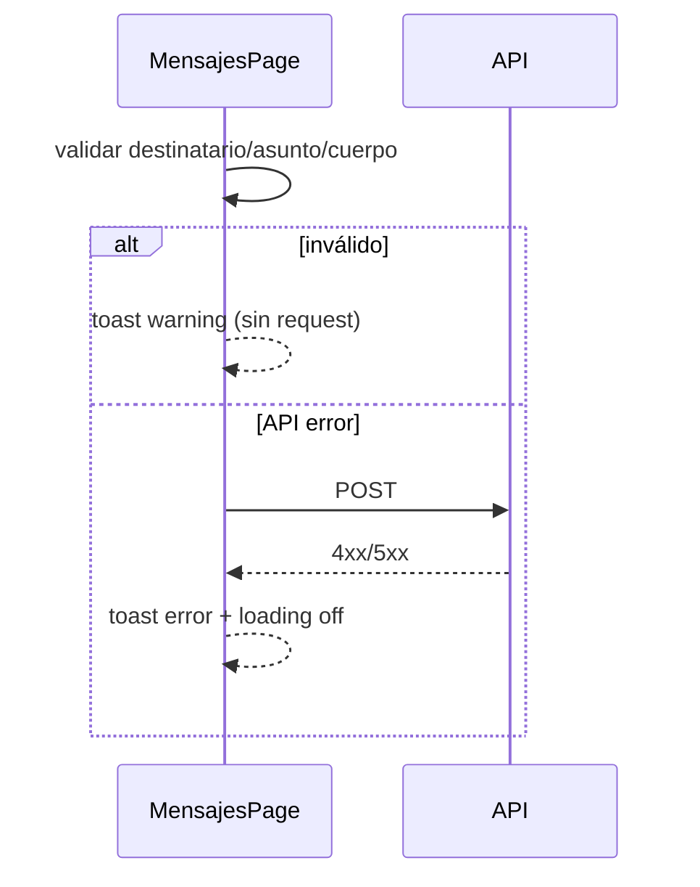
